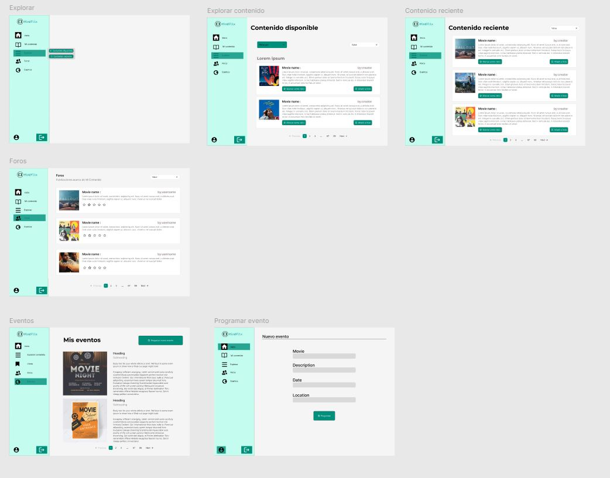

 <h3 align="center"> Universidad Peruana de Ciencias Aplicadas </h3>

 <h3 align="center"> Ingeniería de Software </h3>
 <h3 align="center"> Ciclo 2024 - 2 </h3>

 

  

 
<h3 align="center"> Desarrollo de Aplicaciones Open Source - SW51 </h3>
<h3 align="center"> Profesor: Hugo Allan Mori Paiva </h3>
<h3 align="center"> "INFORME DE TRABAJO FINAL"</h3>
<h3 align="center"> StartUp: ReelHaven </h3>

<h3 align="center"> Producto: "MindFlix"</h3>

-----

## Registro de Versiones Del Informe

| Version | Fecha    | Autor        | Descripcion de modificacion       |
|---------|----------|--------------|-----------------------------------|
|   1.0   | 06-09-24 |   Todos  | Se desarrollo la idea de negocio planeada en un  entorno de desarrollo de aplicaciones Open Source. De igual manera, se llevo a cabo la primera implementacion del Landing Page, y los diseños para la plataforma en su version web.       |  
|         |          |              |                                   |
|         |          |              |                                   |
|         |          |              |                                   |
|         |          |              |                                   |
|         |          |              |                                   |
|         |          |              |                                   |

## Project Report Collaboration Insights 

------

## Contenido

#### Capitulo I: Introducción

- [1.1. Startup Profile](#11-startup-profile)
    - [1.1.1. Descripción de la Startup](#111-descripción-de-la-startup)
    - [1.1.2. Perfiles de Integrantes del equipo](#112-perfiles-de-integrantes-del-equipo)
- [1.2. Solution Profile](#12-solution-profile)
    - [1.2.1. Antecedentes y problematica](#121-antecedentes-y-problematica)
    - [1.2.2. Lean UX Process](#122-lean-ux-process)
        - [1.2.2.1. Lean UX Problem Statements](#1221-lean-ux-problem-statements)
        - [1.2.2.2. Lean UX Assumptions](#1222-lean-ux-assumptions)
        - [1.2.2.3. Lean UX Hypothesis Statements](#1223-lean-ux-hypothesis-statements)
        - [1.2.2.4. Lean UX Canvas](#1224-lean-ux-canvas)
- [1.3. Segmentos Objetivos](#13-segmentos-objetivos)

#### Capitulo II: Requirements Elicitation & Analysis

- [2.1. Competidores](#21-competidores)
    - [2.1.1. Análisis Competitivo](#211-análisis-competitivo)
    - [2.1.2. Estrategias y Tácticas Frente a Competidores](#212-estrategias-y-tácticas-frente-a-competidores)
- [2.2. Entrevistas](#22-entrevistas)
    - [2.2.1. Diseño de Entrevistas](#221-diseño-de-entrevistas)
    - [2.2.2. Registro de Entrevistas](#222-registro-de-entrevistas)
    - [2.2.3. Análisis de Entrevistas](#223-análisis-de-entrevistas)
- [2.3. Needfinding](#23-needfinding)
    - [2.3.1. User Personas](#231-user-personas)
    - [2.3.2. User Task Matrix](#232-user-task-matrix)
    - [2.3.3. User Journey Mapping](#233-user-journey-mapping)
    - [2.3.4. Empathy Mapping](#234-empathy-mapping)
    - [2.3.5. As-is Scenario Mapping](#235-as-is-scenario-mapping)

#### Capitulo III: Requirements Specification
- [3.3. Impact Mapping](#33-impact-mapping)
- [3.4. Product Backlog](#34-product-backlog)
  
#### Capitulo IV: Product  Design

- [4.1. Style Guidelines](#41-style-guidelines)
    - [4.1.1. General Style Guidelines](#411-general-style-guidelines)
    - [4.1.2. Web Style Guidelines](#412-web-style-guidelines)
- [4.2. Information Architecture](#42-information-architecture)
    - [4.2.1. Organization Systems](#421-organization-systems)
    - [4.2.2. Labeling Systems](#422-labeling-systems)
    - [4.2.3. SEO Tags and Meta Tags](#423-seo-tags-and-meta-tags)
    - [4.2.4. Searching Systems](#424-searching-systems)
    - [4.2.5. Navigation Systems](#425-navigation-systems)
- [4.3. Landing Page UI Design](#43-landing-page-ui-design)
    - [4.3.1. Landing Page Wireframe](#431-landing-page-wireframe)
    - [4.3.2. Landing Page Mock-up](#432-landing-page-mock-up)
- [4.4. Web Applications UX/UI Design](#44-web-applications-uxui-design)
    - [4.4.1. Web Application Wireframes](#441-web-application-wireframes)
    - [4.4.2. Web Application Wireflow Diagrams](#442-web-application-wireflow-diagrams)
    - [4.4.3. Web Application Mock-ups](#443-web-application-mock-ups)
    - [4.4.4. Web Application User Flow Diagrams](#444-web-application-user-flow-diagrams)
- [4.5. Web Applications Prototyping](#45-web-applications-prototyping)
- [4.6. Domain-Driven Software Architecture](#46-domain-driven-software-architecture)
    - [4.6.1. Software Architecture Context Diagram](#461-software-architecture-context-diagram)      
    - [4.6.2. Software Architecture Container Diagrams](#462-software-architecture-container-diagrams)
    - [4.6.3. Software Architecture Components Diagrams](#463-software-architecture-components-diagrams)    
- [4.7. Software Object-Oriented Design](#47-software-object-oriented-design)
    - [4.7.1. Class Diagrams](#471-class-diagrams)
    - [4.7.2. Class Dictionary](#472-class-dictionary)
- [4.8. Database Design](#48-database-design)
    - [4.8.1. Database Diagram](#481-database-diagram)
#### Capitulo V: Product Implementation, Validation & Deployment
- [5.1. Software Configuration Management](#51-software-configuration-management)
    - [5.1.1. Software Development Environment Configuration](#511-software-development-environment-configuration)
    - [5.1.2. Source Code Management](#512-source-code-management)
    - [5.1.3. Source Code Style Guide & Conventions](#513-source-code-style-guide--conventions)
    - [5.1.4. Software Deployment Configuration](#514-software-deployment-configuration)
- [5.2. Landing Page, Services & Applications Implementation](#52-landing-page-services--applications-implementation)
    - [5.2.1. Sprint 1](#521-sprint-1)
        - [5.2.1.1. Sprint Planning 1](#5211-sprint-planning-1)
        - [5.2.1.2. Sprint Backlog 1](#5212-sprint-backlog-1)
        - [5.2.1.3. Development Evidence for Sprint Review](#5213-development-evidence-for-sprint-review)
        - [5.2.1.4. Testing Suite Evidence for Sprint Review](#5214-testing-suite-evidence-for-sprint-review)
        - [5.2.1.5. Execution Evidence for Sprint Review](#5215-execution-evidence-for-sprint-review)
        - [5.2.1.6. Services Documentation Evidence for Sprint Review](#5216-services-documentation-evidence-for-sprint-review)
        - [5.2.1.7. Software Deployment Evidence for Sprint Review](#5217-software-deployment-evidence-for-sprint-review)
        - [5.2.1.8. Team Collaboration Insights during Sprint](#5218-team-collaboration-insights-during-sprint)

## STUDENT OUTCOME
<b>ABET – EAC - Student Outcome 3</b>

| Criterio específico                                                                                                                                              | Acciones realizadas                                                                                                                                                      | Conclusiones                                                                                                                                   |
|------------------------------------------------------------------------------------------------------------------------------------------------------------------|--------------------------------------------------------------------------------------------------------------------------------------------------------------------------|-----------------------------------------------------------------------------------------------------------------------------------------------|
| Comunica oralmente con efectividad a diferentes rangos de audiencia.         | **Miembro: Piero Miranda**   **TB1:**   Describir la problematica a tratar en el capitulo 1, analizando el problema y definiendo el segmento objetivo, al igual que describir el proposito de la startup.       **Miembro: Niurka Huarcaya Quispe**   **TB1:**   Realicé una investigación basada en UX Research para establecer adecuadamente los User Personas, Task Matrix, Journey Maps y Empathy Mapping.       **Miembro: Johan Bottger**   **TB1:**   Me encargué del diseño de las entrevistas y realicé una de ellas hacia uno de nuestros segmentos objetivos. Además, realicé la presentación del proyecto.   **TP1:**   Estuve presente y activo en la organización y planeamiento del proyecto y su segundo sprint al igual que su desarollo.       **Miembro**   **TB1:**   (TB1)       **Miembro**   **TB1:**   (TB1)         | Con el trabajo realizado, podemos concluir grupalmente que logramos comunicar de manera efectiva nuestra propuesta de solución al público objetivo, transmitiendo claramente los beneficios y características del producto. Asimismo, supimos adaptar nuestro mensaje a las necesidades y expectativas de diferentes rangos de audiencia.  |                                                                                                                                    |
| Comunica por escrito con efectividad a diferentes rangos de audiencia.   | **Miembro: Piero Miranda**   **TB1:**   Desarrollé secciones del capitulo 4 como style guidelines, diseño de landing page, web wireframes y mockups, y software management en el capitulo 5       **Miembro: Niurka Huarcaya Quispe**   **TB1:**   Se realizó el Design y Prototyping, bajo un enfoque ágil evidenciado de forma escrita       **Miembro: Johan Bottger**   **TB1:**    Me encargué en explorar e investigar el mercado actual para identificar los posibles competidores y sus estándares.    **TP1:**   Fui responsable del desarrollo de la sección Listas, además del apoyo en la correción del informe escrito.       **Miembro**   **TB1:**   (TB1)       **Miembro**   **TB1:**   (TB1)         | Gracias a la documentación detallada y al Landing Page implementado, logramos transmitir nuestras ideas de manera clara y efectiva. Además, presentamos un concepto visual atractivo del producto que refuerza la comunicación escrita, permitiendo que nuestro público objetivo entienda la propuesta y los beneficios de forma precisa. |

# Capitulo I: Introducción
## 1.1. Startup Profile

### 1.1.1. Descripción de la Startup

Somos ReelHaven y te presentamos MindFlix, una aplicación innovadora diseñada para ayudar a las personas a reducir el estrés cotidiano mediante recomendaciones personalizadas de películas, series y documentales. MindFlix no solo se centra en mejorar el bienestar mental de sus usuarios, sino que también ofrece un espacio para que los creadores de contenido promuevan sus obras enfocadas en la salud mental y el bienestar.

**Objetivo:** Brindar una plataforma novedosa que ayude a las personas a reducir el estrés y mejorar su bienestar mental mediante recomendaciones personalizadas de contenido audiovisual, a la vez que apoya a los creadores en la difusión de sus proyectos relacionados con la salud mental.

**Misión:** En ReelHaven, nuestra misión es mejorar la vida de nuestros usuarios ofreciéndoles una experiencia de entretenimiento personalizada que impulse su bienestar mental y emocional. Con MindFlix, buscamos crear una comunidad inclusiva y empática, donde los usuarios puedan descubrir contenido inspirador, participar en debates enriquecedores y acceder a recursos adicionales para su bienestar. Al mismo tiempo, promovemos las creaciones de cineastas y productores, impulsando un entorno de colaboración y crecimiento compartido.

### 1.1.2 Perfiles de integrantes del equipo

<table align="center"  border="1" width="70%" style="text-align:center;">
    <tr align="center">
        <td rowspan="3">
             
        </td>
        <td align="left">
            <b>Nombre y Apellido:</b>
             
            Piero Stephano Miranda Sinarahua
        </td>
    </tr>
    <tr>
        <td align="left">
        <b>Carrera:</b>
         
        Ingeniería de Software
        </td>
    </tr>
    <tr>
        <td align="left">
        <b>Acerca de:</b>
         
        Me llamo Piero Miranda y actualmente estoy llevando la carrera de Ingeniería de Software. Considero que soy una persona responsable y que puedo aportar al equipo en cualquier aspecto que se requiera. De igual 
         manera, siento que los conocimientos que he ido adquiriendo en ciclos anteriores serán de gran ayuda para llevar a cabo el presente trabajo.
        </td>
    </tr>
    <tr align="center">
        <td rowspan="3">
            
        </td>
        <td align="left">
            <b>Nombre y Apellido:</b>
             
            Johan Karl Bottger Salazar
        </td>
    </tr>
    <tr>
        <td align="left">
        <b>Carrera:</b>
         
        Ingeniería de Software
        </td>
    </tr>
    <tr>
        <td align="left">
        <b>Acerca de:</b>
         
       Soy Johan Bottger, estoy en mi sexto ciclo de la carrera Ingeniería de Software en la UPC. Tengo conocimientos en los lenguajes C++, Python, JavaScript y HTML. Tengo gran interés en las metodologías ágiles por lo que en un futuro quisiera dedicarme a su implementación.
        </td>
    </tr>
    <tr align="center">
        <td rowspan="3">
           
        </td>
        <td align="left">
            <b>Nombre y Apellido:</b>
             
            Gabriel Omar Lapa de la Cruz
        </td>
    </tr>
    <tr>
        <td align="left">
        <b>Carrera:</b>
         
        Ingeniería de Software
        </td>
    </tr>
    <tr>
        <td align="left">
        <b>Acerca de:</b>
         
        Mi nombre es Gabriel Omar Lapa de la Cruz y tengo 23 años. Soy estudiante de la carrera de Ingeniería de Software. Escogí esta carrera ya que me llamó la atención el desarrollo de diferentes tipos de softwares
	y aplicaciones. Estoy mayormente acostumbrado al trabajo individual, pero mis responsabilidades pueden ayudar al grupo en lo que sea necesario.
        </td>
    </tr>
    <tr align="center">
        <td rowspan="3">
           
        </td>
        <td align="left">
            <b>Nombre y Apellido: </b>
             
            Niurka Lucero Huarcaya Quispe
        </td>
    </tr>
    <tr>
        <td align="left">
        <b>Carrera:</b>
         
        Ingeniería de Software
        </td>
    </tr>
    <tr>
        <td align="left">
        <b>Acerca de:</b>
         
        Mi nombre es Niurka Huarcaya, con el código U20221B226 y soy estudiante de Ingeniería de Software. Mi experiencia abarca varios lenguajes de programación, incluyendo C++ y Python, así como bases de datos. Considero que puedo trabajar en armonía con el equipo y escuchar sus ideas para lograr un buen trabajo.
        </td>
    </tr>
    <tr align="center">
        <td rowspan="3">
            
        <td align="left">
            <b>Nombre y Apellido:</b>
             
            Sebastián De Las Casas Latour
        </td>
    </tr>
    <tr>
        <td align="left">
        <b>Carrera:</b>
         
        Ingeniería de Software
        </td>
    </tr>
    <tr>
        <td align="left">
        <b>Acerca de:</b>
         
        Mi nombre es Sebastián De Las Casas, soy estudiante de Ingenieria de Software. Tengo experiencia con lenguajes de programación como python y c++. 
        </td>
    </tr>
	  
</table>

## 1.2. Solution Profile
En esta sección se analizarán cuales son los antecedentes y la problemática acerca del estrés y cansancio mental de las personas luego de realizar actividades cotidianas y cómo el entretenimiento audiovisual está involucrado en el tema . Luego, se examinará la raíz del problema, con ayuda de un proceso UX, el cual ayudará a identificar las necesidades que ayuden a encontrar una solución a la problemática mencionada. 

### 1.2.1. Antecedentes y problematica
**Quien?** Las personas que estudian, trabajan, o realizan ambas actividades. Se pueden incluir a universitarios que llevan a cabo actividades académicas la mayor parte del día. También se incluyen personas las cuales trabajan arduamente durante el día. O personas que realizan ambas actividades. El rango de personas que cumplen con dichas características suelen variar entre los 18 a 50 años. 
También se toma en cuenta a creadores de contenido relacionados con el bienestar mental, ya sean directores, productores, actores, etc. Estas personas buscarían formas de difundir su contenido en alguna plataforma.

**Qué?** Los usuarios mencionados presentan cierto nivel de cansancio mental o estrés luego de realizar sus actividades estudiantiles o laborales y no pueden encontrar contenido el cual les ayude no solo a distraerse, sino también a reducir ese nivel de estrés, mejorando así su salud mental. 

**Dónde?** En la ciudad de Lima-Perú  se puede observar a muchas personas que cumplen con las características descritas. Tanto en las calles como en los mismos hogares se puede evidenciar el nivel de cansancio que presentan estas personas.

**Por qué?** El deterioro de salud mental provocado por estrés es un problema creciente en la población, el cual muchas veces no se le da la suficiente atención. Existe una demanda en formas para combatir dicho estrés por medio de entretenimiento visual, los cuales tocan temas que ayudan a regular el bienestar mental de las personas. 

**Cuando?** Se evidencia el problema luego de largas jornadas de trabajo, exámenes, incluso durante tiempos de descanso, ya sean periodos cortos o al momento de retornar a sus hogares.

**Cómo?** Se cree que ciertos contenidos audiovisuales, como películas, series,documentales, pueden ayudar a contrarrestar el cansancio de las personas,  y así cambiar la mentalidad de los usuarios, al igual que su estado de ánimo. 

**Cuánto?** Se considera un sistema de suscripciones el cual ayude a financiar una solución óptima que ofrezca alternativas que ayuden a los usuarios a normalizar su bienestar mental

En conclusión, existe una problemática en la ciudad de Lima relacionada con el deterioro de la salud mental de las personas causadas por el cansancio o estrés luego de realizar actividades laborales y/o académicas durante largas jornadas. De igual manera, se tiene en cuenta que existen medios, como contenido audiovisual (películas, series, documentales), los cuales pueden ayudar a mejorar el ánimo de las personas y de cierta forma aliviar la fatiga mental que pueden tener los usuarios

### 1.2.2. Lean UX Process

#### 1.2.2.1. Lean UX Problem Statements

Ciudadanos universitarios y/o trabajadores buscan formas de relajarse y reducir el cansancio mental luego de largas jornadas de estudio/trabajo, pero les suele ser difícil encontrar algún contenido que les ayude a desconectar y aliviar dicha fatiga. Debido a esto, muchos experimentan altos niveles de estrés lo cual produce un deterioro de su salud mental con el tiempo. Si bien existe cierto contenido el cual puede ayudar a los usuarios a contrarrestar este agotamiento mental, no se encuentra una plataforma la cual ofrezca contenido personalizado de acuerdo al estado de ánimo del usuario. Si este problema se resuelve, las personas podrían contar con recursos audiovisuales que le alineen a sus necesidades y les permitan relajarse de forma efectiva, logrando así reducir sus niveles de estrés y mejorando su bienestar mental.

#### 1.2.2.2. Lean UX Assumptions

**Business Assumptions** 

* Lograr aumentar nuestro público objetivo gradualmente con el tiempo.
* Las ganancias iniciales deben compensar el capital invertido para el negocio
* Obtener mayor ganancias con las suscripciones con el fin de aumentar los beneficios para los usuarios. 

**Users**

*Ciudadanos universitarios/trabajadores
*Creadores de contenido

**User Outcomes**

*Ciudadanos universitarios/trabajadores:*

*Desconectar de sus actividades académicas/laborales con el fin de aliviar el estrés. 
*Conocer nuevo contenido audiovisual que los ayuden a cambiar su estado de ánimo.

*Creadores de contenido:*

*Difundir sus producciones y que lleguen a un mayor público.
*Obtener feedback acerca del contenido desarrollado

**Features**

* Contenido personalizado para el usuario en cuanto a películas/series/documentales. 
* Foros en los cuales se compartan opiniones acerca del contenido recomendado. 
* Información acerca de eventos a los cuales los usuarios pueden asistir de manera presencial. 
* Impulso de contenido que promueve el bienestar mental. 

**Business Assumptions**

1. **Creemos que nuestros clientes necesitan** un medio en el cual encontrar recomendaciones de contenido audiovisual el cual le brinde mejoría en su bienestar mental. Para los creadores de contenido, un espacio donde su contenido alcance el público que se plantean.
2. **Estas necesidades se pueden resolver con** una plataforma la cual conozca la situación mental del usuario y le brinde recomendaciones adecuadas a sus necesidades y promueva el contenido relacionado a bienestar mental.
3. **El valor #1 que mi cliente quiere de mi servicio es** efectividad al momento de encontrar una solución para calmar sus problemas. En cuanto a los creadores, que sus producciones lleguen a la mayor cantidad de público objetivo posible.
4. **El cliente también puede obtener beneficios adicionales como** acceso a una gran cantidad de películas, series, documentales, los cuales pueden tomar en cuenta sin importar la situación en la que estén. Además de opiniones de otros usuarios y eventos a los que asistir. Para los creadores, la opción de crear eventos dedicados a personas que quieran ver sus producciones en vivo.
5. **Voy a adquirir la mayoría de mis clientes con** publicidad en redes sociales y grupos en los cuales se hable de temas relacionados con películas/series/documentales.
6. **Haré dinero a través de** distintos niveles de suscripción para poder acceder a la plataforma.
7. **Mi competencia principal en el mercado** aplicaciones que brinden servicios de streaming de películas o que ofrezcan recomendaciones de películas 
8. **Lo venceremos debido a**    nuestra propuesta de valor se relaciona con recomendaciones personalizadas al usuario 
9. **El mayor riesgo es que** existan errores al momento de recomendar el contenido y que el usuario no esté de acuerdo con lo recomendado.
10. **Resolveremos esto a través de** un análisis previo en el cual se conozca las emociones y estado de ánimo actual del usuario. 

**User Assumptions**

**Who is the user?**

* Ciudadanos universitarios/trabajadores que presenten gran cansancio mental luego de largas jornadas de estudio/trabajo
* Creadores de contenido que toquen temas en específico y ayuden a mejorar el ánimo de su público. 

**Where does our product fit in their work or life?**

El aplicativo encaja tanto en las consecuencias del arduo trabajo o estudio del usuario, como en el estado de ánimo actual que tenga el usuario al interactuar con el producto. 

**What problem does our product solve?**

El producto contrarresta el estrés de los usuarios y ayuda a promover el bienestar mental a través de contenido audiovisual

**When and how is our product used?**

El aplicativo podría usarse en un lapso de descanso que tengan los usuarios al igual que en sus días libres . Para los creadores de contenido, se puede emplear al momento de estrenar nuevo contenido audiovisual. 

**What features are important?**

Que el producto cumpla con recomendar las películas/series/documentales más precisas de acuerdo a la necesidad del usuario que lo requiera.

**How should our product look and behave?**

El producto debe verse amigable con el usuario, funcional y simple de usar, esto con el objetivo que cualquier persona que lo requiera pueda usar la aplicación, sin importar que esté familiarizado con otras plataformas similares o no. 

#### 1.2.2.3. Lean UX Hypothesis Statements

* **Creemos que**  el sistema de recomendación de contenido propuesto por nuestra plataforma hacia nuestros usuarios logrará elevar el estado de ánimo de las personas y aliviará el agobio mental que puedan estar atravesando al momento. **Sabremos que esto es cierto cuando** el porcentaje de usuarios activos en la aplicación aumente en un 20% durante los primeros meses.

* **Creemos que** el impacto que tendría un sistema por el cual los usuarios compartan opiniones acerca de nuestra aplicación será considerable tomando en cuenta la competencia .**Sabremos que hemos tenido éxito cuando** leamos los comentarios positivos por parte de los usuarios publicados en los foros incluidos en la misma plataforma virtual.

* **Creemos que** la ciudadanía en general dará mayor importancia a la salud mental y tomará en cuenta métodos audiovisuales para calmar sus angustias .**Sabremos que hemos tenido éxito cuando** interactuamos con los usuarios y evidenciamos que realizan sus actividades cotidianas con buena actitud

#### 1.2.2.4. Lean UX Canvas

## 1.3. Segmentos Objetivos

Nuestra propuesta de solución está dirigida hacia 2 segmentos objetivos, los cuales son: 

* **Ciudadano universitario/trabajador promedio:** se considera a un usuario, en el rango de edades de 18 a 50 años aproximadamente, el cual presenta problemas relacionados con cansancio mental a raíz del estrés académico o laboral. 

* **Creador de contenido de salud mental:** personas involucradas en la creación de películas/series/documentales en los cuales se desarrollan temas que contribuyan en cambiar la mentalidad de las personas y mejorar su bienestar mental.

# Capítulo II: Requirements Elicitation & Analysis

## **2.1. Competidores**
### **2.1.1. Análisis competitivo**

<table border="1" style="width:100%">
    <tr>
        <th colspan="6">Competitive Analysis Landscape</th>
    </tr>
    <tr>
        <th>Startup y Competidores</th>
        <th>MindFlix</th>
        <th>Headspace</th>
        <th>Calm</th>
        <th>TeenToks</th>
    </tr>
    <tr>
        <td>Overview</td>
        <td>Aplicación de contenido relacionado al bienestar mental</td>
        <td>App de meditaciones guiadas</td>
        <td>App de meditaciones enfocado en dormir</td>
        <td>Aplicación de contenido de bienestar hecho por y para adolescentes</td>
    </tr>
    <tr>
        <td>Mercado Objetivo</td>
        <td>Creadores de contenido, Estudiantes y trabajadores</td>
        <td>Meditadores principiante</td>
        <td>Personas que sufren de Insomnio</td>
        <td>Adolescentes creadores de contenido y consumidores</td>
    </tr>
    <tr>
        <td>Perfil y Estrategias de Marketing</td>
        <td>Anuncios, Publicidad Boca a boca</td>
        <td>Anuncios en redes sociales, Búsqueda de Palabras claves, SEO</td>
        <td>Anuncio en redes sociales usadas por mercado objetivo</td>
        <td>Publicidad en redes sociales</td>
    </tr>
    <tr>
        <td>Productos y Servicios</td>
        <td>Consumo de contenido de diferentes creadores</td>
        <td>Membresías gratis y premium</td>
        <td>Membresía</td>
        <td>Contenido de usuario</td>
    </tr>
    <tr>
        <td>Precios y Costos</td>
        <td>$69.99 Anual por premium</td>
        <td>$39.99 Anual o $399.99 por vida</td>
        <td>Gratis con anuncios</td>
        <td>Gratis</td>
    </tr>
    <tr>
        <td>Canales de Distribución</td>
        <td>Sitio Web</td>
        <td>Aplicación Android y iOS</td>
        <td>Aplicación móvil y canal en YouTube</td>
        <td>Aplicación móvil</td>
    </tr>
    <tr>
        <td>Fortalezas</td>
        <td>Contenido creado por usuarios</td>
        <td>Respaldado por psicólogos</td>
        <td>Enganche diario de usuarios</td>
        <td>Segmento definido</td>
    </tr>
    <tr>
        <td>Debilidades</td>
        <td>Desconocido en el mercado</td>
        <td>Precio elevado, no hay contenido de usuario</td>
        <td>No existe versión gratuita</td>
        <td>Mercado limitado</td>
    </tr>
    <tr>
        <td>Ventaja Competitiva</td>
        <td>Contenido generado por usuarios de varios formatos</td>
        <td>Conocido en el mercado</td>
        <td>Líder de mercado</td>
        <td>Contenido de Usuario</td>
    </tr>
</table>

### **2.1.2. Estrategias y tácticas frente a competidores**

Nuestro producto se diferencia de sus competidores en el segmento de ciudadanos por su contenido de usuario personalizado en cuanto a películas/series/documentales. Además, resalta como una alternativa para creadores de contenido de salud mental que buscan un lugar para difundir sus proyectos, contribuyendo a mejorar el bienestar de un mayor público.

## **2.2. Entrevistas**

### **2.2.1. Diseño de Entrevistas**

#### Formato de Preguntas para Entrevistas (Ambos segmentos)

1. **Introducción (Nombre, Edad)**

2. **Conexión con Problemática**
   - ¿Estudias, trabajas, o realizas ambas actividades? ¿Cuánta parte de tu día dedicas a ello?

3. **Identificación de Segmento Objetivo**
   - ¿Presenta problemas relacionados con cansancio mental a raíz del estrés académico/laboral? (Según corresponda)
   - ¿Conoces de alguien involucrado en la creación de vídeos/películas/series/documentales en los cuales se desarrollan temas que contribuyan en cambiar la mentalidad de las personas y mejorar su bienestar mental?

4. **Familiaridad con Competidores**
   - ¿Conoces alguna aplicación, página, o red social que ayude a promover el bienestar mental a través de contenido audiovisual? De ser así, ¿cuáles de estas has usado? [Explicación breve del startup]

5. **Estimación de Interés en el Startup**
   - A partir de lo explicado, ¿te verías utilizando la aplicación descrita? De ser así, ¿qué funcionalidades esperarías de ella?

### **2.2.2. Registro de entrevistas**
**Entrevista para el "Ciudadano universitario/trabajador promedio":**

**Entrevista N°1:**
- Nombre: Sergio
- Apellidos: Licas Rodriguez
- Edad: 40 años
- Ubicación: San Borja - Lima
- Inicio de la Entrevista: 0:00 
- Duración de la Entrevista: 4:12 min

**Resumen de la Entrevista:**
  
El sr. Sergio, trabajador de ayudante de cocina, cuenta que hay muchas semanas en las que debido a la carga laboral suele presentar ciertos niveles de estrés o cansancio mental, y que en muchas ocasiones, le es difícil encontrar un momento para desconectarse y relajarse. También comenta que consume plataformas de contenido vía streaming, como netflix, además de youtube. Él dice encontrar contenido que trate temáticas relacionadas a mejorar en bienestar mental, pero lo encuentra de manera indirecta, y que no es fácil de encontrar películas o series relacionadas a esta temática si las busca por cuenta propia. 
Luego de comentarle la idea del aplicativo, el sr.Sergio opina qué le parece una buena idea promover contenido que ayude a aliviar problemas de estrés y cansancio mental. También comenta que la idea de los foros le parece buena, y que le gustaría poder ver las distintas opiniones de personas que puedan tener problemas similares a los suyos, saber sus experiencias con el aplicativo y tomar recomendaciones adicionales de ellos. 

**Entrevista N°2:**
- Nombre: Angela
- Apellidos: Ushiñahua Becerra
- Edad: 23 años
- Ubicación: Villa el Salvador - Lima
- Inicio de la Entrevista: 0:02
- Duración de la Entrevista: 04:43 min
- Video: https://drive.google.com/file/d/1nnz7haXusitUq_7FSzJiTlytl-_0XCRZ/view?usp=sharing

**Resumen de la Entrevista:**

Ángela nos comenta que trabaja 10 horas al día, lo que le genera estrés y ansiedad, llevándola a depender de medicamentos para dormir. Le interesan soluciones de bienestar mental, aunque no conoce a creadores de contenido en esa área. Ha utilizado una página de Facebook llamada Psicología Mental, que le ayudó temporalmente.

Al escuchar sobre MindFlix, una aplicación diseñada para ayudar a las personas a aliviar el estrés mediante contenido audiovisual, Ángela se mostró interesada. Destacó la importancia de poder acceder a sesiones o terapias en vivo, en cualquier momento del día, ya que su horario laboral no le permite encontrar ayuda en horas convencionales. Para ella, sería clave contar con la posibilidad de recibir consejos o guías de expertos en salud mental, disponibles en cualquier horario, y poder participar en discusiones y acceder a contenido relevante para su bienestar.

**Entrevista para el "Creador de contenido de salud mental":**

**Entrevista N°3:**
- Nombre: Diego
- Apellidos: Cacho Seminario
- Edad: 20 años
- Ubicación: Surco - Lima
- Inicio de la Entrevista: 0 .
- Duración de la Entrevista: 05:00 minutos

**Resumen de la Entrevista:**
Diego tiene el hobby de producir videos cortos acerca del bienestar emocional y la salud mental. Le interesa una plataforma que lo ayude a agrandar su público a personas interesadas en cambiar su mentalidad. Conocía a uno de nuestro competidores y remarcó la falta de contenido de usuarios. Destacó la importancia de una aplicación simple de usar para los usuarios.

**Entrevista N°4:**
- Nombre: Nataly
- Apellidos: Huarcaya Quispe
- Edad: 26 años
- Ubicación: Surco - Lima
- Inicio de la Entrevista: 0:02
- Duración de la Entrevista: 02:44

**Resumen de la Entrevista:**
Nataly comenta que trabaja en el rubro de psicología y estudia marketing. Su tiempo se divide en el trabajo por las mañanas y los estudios por la noche. Es una creadora de contenido que se centra en temas de salud mental y bienestar. Utiliza en su mayoría las redes sociales, para compartir y promocionar su contenido y conocer más creadores que hablen sobre estos temas. Además, menciona que estaría dispuesta a usar la solución web, si puede facilitarle la promoción de su contenido a personas realmente interesadas en el bienestar emocional y recibir retroalimentación de sus consumidores. 

**Entrevista N°5:**
- Nombre: 
- Apellidos:
- Edad: 
- Ubicación:
- Inicio de la Entrevista:
- Duración de la Entrevista:

**Resumen de la Entrevista:**

### **2.2.3. Análisis de entrevistas**

<table border="1">
    <tr>
        <td colspan="2" align="center"><b>Características</b></td>
        <td align="center"><b>Ciudadano universitario/trabajador promedio</b></td>
        <td align="center"><b>Creador de contenido de salud mental</b></td>
    </tr>
    <tr>
        <td rowspan="3"><b>Objetivas</b></td>
        <td>Carga laboral y estrés</td>
        <td>El 100% enfrenta estrés y cansancio mental debido a la carga laboral.</td>
        <td>No relevante</td>
    </tr>
    <tr>
        <td>Dificultad para relajarse</td>
        <td>El 50% tiene problemas para encontrar tiempo para relajarse.</td>
        <td>No relevante</td>
    </tr>
    <tr>
        <td>Consumo de Plataformas de Streaming</td>
        <td>El 50% usa plataformas como Netflix y YouTube para bienestar mental, pero tiene dificultades para encontrar contenido específico.</td>
        <td>El 50% usa redes sociales para promocionar su contenido de bienestar mental, el resto conoce más plataformas para compartir su contenido</td>
    </tr>
    <tr>
        <td rowspan="3"><b>Subjetivas</b></td>
        <td>Interés en Contenido de Bienestar Mental</td>
        <td>El 100% está interesado en contenido para aliviar estrés y cansancio mental.</td>
        <td>El 100% está interesado en ampliar su audiencia con contenido de bienestar emocional.</td>
    </tr>
    <tr>
        <td>Interés en Terapias y Consejos en Vivo</td>
        <td>El 50% valora el acceso a terapias y consejos en vivo.</td>
        <td>No relevante</td>
    </tr>
    <tr>
        <td>Herramientas de Promoción y Retroalimentación</td>
        <td>No relevante</td>
        <td>El 100% busca herramientas para ampliar su público y obtener retroalimentación.</td>
    </tr>
</table>

## **2.3. Needfinding**
### **2.3.1. User Personas**
En el desarrollo de servicios, comprender a los usuarios es fundamental para diseñar soluciones que realmente satisfagan sus necesidades. Las fichas de User Personas son herramientas que nos permiten entender mejor a nuestros segmentos objetivo. Se realizaron entrevistas y se analizaron con el objetivo de identificar necesidades comunes de los usuarios. De acuerdo a lo obtenido, se crearon perfiles detallados para los dos arquetipos de usuarios.
- **Primer segmento: Ciudadano universitario/trabajador promedio**
  

- **Segundo segmento: Creador de contenido de salud mental**

### **2.3.2. User Task Matrix**

| Tareas del usuario                                      | Ciudadano universitario/trabajador promedio           | Creador de contenido de salud mental                 |
|---------------------------------------------------------|--------------------------------------------------------|------------------------------------------------------|
| Búsqueda de plataforma con contenido para relajarse     | Frecuencia: Alta Importancia: Alta                  | Frecuencia: Media Importancia: Media              |
| Búsqueda de recomendaciones sobre contenido relajante   | Frecuencia: Alta Importancia: Alta                  | Frecuencia: Baja Importancia: Media               |
| Reproducción del contenido que se adapta a sus necesidades | Frecuencia: Alta Importancia: Alta                  | Frecuencia: Media Importancia: Media              |
| Recolección de referencias del contenido                | Frecuencia: Baja Importancia: Baja                  | Frecuencia: Alta Importancia: Alta                |
| Lectura de contenido acerca de la mejora del bienestar  | Frecuencia: Media Importancia: Media                | Frecuencia: Alta Importancia: Alta                |
| Implementación de consejos o técnicas aprendidas        | Frecuencia: Media Importancia: Alta                 | Frecuencia: Media Importancia: Media              |
| Gestión de preferencias del contenido que consume       | Frecuencia: Media Importancia: Alta                 | Frecuencia: Media Importancia: Alta               |

El usuario ciudadano trabajador / universitario se enfoca mayormente en la búsqueda y consumo de contenido relajante, evidenciado con una alta importancia en la búsqueda de recomendaciones y reproducción de contenido que se ajuste a sus necesidades. Se interesa en la mejora del bienestar por lo que lee contenido e implementa los consejos. Por otro lado, el segundo segmento, creador de contenido audiovisual, comparte la alta prioridad a la búsqueda de plataformas que ofrezcan contenido relajante, pero le asigna mayor importancia a la recolección de referencias, lectura de técnicas para el bienestar y gestión de preferencias.

### **2.3.3. User Journey Mapping**
- **Primer segmento: Ciudadano universitario/trabajador promedio**
  

- **Segundo segmento: Creador de contenido de salud mental**
  

### **2.3.4. Empathy Mapping**
- **Primer segmento: Ciudadano universitario/trabajador promedio**
  

- **Segundo segmento: Creador de contenido de salud mental**
  

### **2.3.5. As-is Scenario Mapping**
**Ciudadano trabajador / universitario***

**Creador de contenido audiovisual***

https://miro.com/app/board/uXjVKkQHFZI=/?share_link_id=942422651628

## **2.4. Ubiquitous Language**
En esta sección se definirá el lenguaje ubicuo para facilitar la comunicación efectiva entre los miembros del equipo de desarrollo y los interesados en el proyecto. Este glosario de términos clave asegura una comprensión clara y un acuerdo común sobre los conceptos fundamentales.

- **Usuario:** Persona que utiliza MindFlix para acceder a contenido audiovisual con el objetivo de mejorar su bienestar mental.
- **Creador de Contenido:** Persona encargada de producir y subir contenido audiovisual a MindFlix, enfocado en temas de bienestar mental y relajación.
- **Suscriptor:** Usuario que paga una tarifa para acceder a contenido exclusivo y funciones adicionales en MindFlix.
- **Recomendación Personalizada:** Sistema de sugerencias automáticas en MindFlix basado en las preferencias y el historial de visualización del usuario.
- **Contenido Audiovisual:** Material disponible en MindFlix, como películas, series y documentales, diseñado para promover el bienestar mental.
- **Perfil de Usuario:** Información detallada sobre un usuario en MindFlix, incluyendo historial de visualización, preferencias y niveles de suscripción.
- **Interacción en la Plataforma:** Actividades realizadas por los usuarios en MindFlix, como dejar comentarios, participar en discusiones y evaluar el contenido.
- **Métricas de Impacto:** Datos recopilados por MindFlix que evalúan el efecto del contenido en el bienestar mental de los usuarios, como cambios en el estado de ánimo.
- **Panel de Control:** Herramienta dentro de MindFlix que permite a los usuarios seguir su progreso en el bienestar mental y explorar contenido relacionado.

# Capítulo III: Requirements Specification

## **3.1. To-Be Scenario Mapping**
**Ciudadano trabajador / universitario***

**Creador de contenido audiovisual***

https://miro.com/app/board/uXjVKkXdjos=/?share_link_id=419241166516

## **3.2. User Stories**

- Las User Stories, o historias de usuario, son descripciones breves y centradas en el usuario de una funcionalidad específica del producto. Nos ayudan a comprender las necesidades y expectativas de nuestros usuarios al abordar qué quieren lograr y por qué. Al escribir User Stories, nos centramos en el valor que proporcionará la funcionalidad para el usuario y en cómo la utilizará en su contexto. Esto nos permite priorizar las características del producto de acuerdo con su importancia para el usuario y desarrollar soluciones que realmente resuelvan sus problemas y satisfagan sus necesidades.
Para elaborar user stories que pertenecen a un epic. A continuación, las epics que consideramos como equipo:

| Código | Título | Epic |
|--------|--------|------|
|EP01 | Gestión de cuentas | Como usuario quiero poder gestionar mi cuenta, para cambiar y actualizar la información de la misma, así como mis preferencias y ajustes de privacidad.
|EP02|Visualización de User Interface|Como usuario de la plataforma, quiero poder ver la interfaz de usuario del landing page y la plataforma, para explorar todas las funcionalidades disponibles y entender cómo interactuar con la plataforma.
|EP03|Interacción con la plataforma|Como usuario quiero poder interactuar con la plataforma para crear, editar o eliminar mi contenido, e interactuar con otros usuarios.
|EP04|Desarrollo de funcionalidades principales|Como equipo de desarrollo quiero implementar las funcionalidades básicas, para establecer una base sólida donde poder desarrollar nuevas características.
|EP05|Funcionalidad del Landing Page de la plataforma|Como usuario quiero poder utilizar las diferentes características de la plataforma en su landing page para conocer información y detalles de la misma

A continuación, la realización de los user stories con sus criterios de aceptación con escenarios e ID de Épica:

| ID User Story | Título | Descripción | Criterios de aceptación | ID Epic |
|---------------|--------|-------------|-------------------------|---------|
|US01|Iniciar sesión|Como usuario registrado, quiero poder iniciar sesión en mi cuenta, para utilizar las funciones disponibles de la plataforma.|Happy Path: Given el usuario tiene credenciales válidas. Then el usuario accede a la plataforma con su usuario. When el usuario ingresa sus credenciales válidas y presiona "Iniciar sesión". Unhappy Path: Given el usuario tiene credenciales inválidas. When el usuario ingresa credenciales inválidas y presiona "Iniciar sesión". Unhappy Path: Given el usuario no tiene una cuenta. When el usuario intenta iniciar sesión sin estar registrado. Then el sistema muestra un mensaje de error junto con un enlace para registrarse.|EP01|
|US02|Recuperar Contraseña|Como usuario de la plataforma, Quiero poder recuperar mi contraseña olvidada, Para poder acceder nuevamente a mi cuenta.	|Happy Path: Given el usuario ha olvidado su contraseña. When el usuario solicita restablecer la contraseña. Then el sistema envía un correo electrónico con un enlace de restablecimiento. Unhappy Path: Given el usuario no ha olvidado su contraseña. When el usuario intenta restablecerla sin haber olvidado la contraseña. Then el sistema muestra un mensaje indicando que la contraseña es incorrecta. Unhappy Path: Given el usuario no tiene una cuenta. When el usuario intenta restablecer la contraseña sin estar registrado. Then el sistema muestra un mensaje indicando que la cuenta no existe.|EP01|
|US03|Actualizar Información Personal|Como usuario registrado, Quiero poder actualizar mi información personal en mi perfil, Para mantenerla actualizada y precisa.| Happy Path: Given que el usuario desea cambiar su información personal. When el usuario realiza cambios en su perfil y guarda. Then el sistema actualiza la información en la base de datos. Unhappy Path: Given que el usuario intenta guardar información inválida. When el usuario intenta guardar cambios con campos obligatorios vacíos. Then el sistema muestra un mensaje indicando los campos obligatorios. Unhappy Path: Given que el usuario desea eliminar su foto de perfil. When el usuario elimina la foto y guarda los cambios. Then el sistema elimina la foto de perfil y actualiza la información en la base de datos.| EP01|
|US04|Filtrar Contenido por Categoría|Como usuario, Quiero poder filtrar el contenido por categoría, Para encontrar información relevante más fácilmente.|Happy Path: Given que el usuario desea ver contenido específico. When el usuario selecciona una categoría de filtrado. Then la plataforma muestra solo el contenido de esa categoría. Unhappy Path: Given que el usuario intenta filtrar contenido con una categoría no existente. When el usuario selecciona una categoría inexistente. Then la plataforma no muestra ningún contenido y muestra un mensaje informativo. Unhappy Path: Given que el usuario intenta filtrar contenido sin seleccionar ninguna categoría. When el usuario intenta aplicar un filtro sin seleccionar una categoría. Then la plataforma no realiza cambios y muestra un mensaje informativo. |EP02|
|US05|Dar “Me Gusta” a contenido|Como usuario de la plataforma, Quiero poder dar "Me Gusta" al contenido de otros usuarios, Para mostrar aprecio por el contenido.|Happy Path: Given que el usuario ve una publicación que le gusta. When el usuario hace clic en el botón "Me Gusta". Then el sistema incrementa el contador de "Me Gusta" en la publicación. Unhappy Path: Given que el usuario intenta dar "Me Gusta" a una publicación ya gustada. When el usuario intenta dar "Me Gusta" a una publicación que ya ha sido gustada por él. Then el sistema no realiza cambios en el contador de "Me Gusta". Unhappy Path: Given que el usuario intenta dar "Me Gusta" a una publicación sin estar autenticado. When el usuario intenta dar "Me Gusta" a una publicación sin haber iniciado sesión. Then el sistema redirige al usuario a la página de inicio de sesión. |EP03|
|US06|Compartir publicaciones|Como usuario, Quiero poder compartir publicaciones en mis redes sociales, Para compartir contenido interesante con otros.|Happy Path: Given que el usuario desea compartir una publicación. When el usuario hace clic en el botón de compartir y selecciona una red social. Then el sistema abre la página de la red social seleccionada. Unhappy Path: Given que el usuario intenta compartir una publicación sin seleccionar una red social. When el usuario intenta compartir una publicación sin seleccionar una red social. Then el sistema muestra un mensaje indicando que se debe seleccionar una red social. Unhappy Path: Given que el usuario intenta compartir una publicación sin estar autenticado. When el usuario intenta compartir una publicación sin haber iniciado sesión. Then el sistema redirige al usuario a la página de inicio de sesión. |EP03|
|TS070|Configurar Entorno de Desarrollo|Como desarrollador, Quiero configurar mi entorno de desarrollo local, Para poder comenzar a trabajar en el proyecto.|Happy Path: Given que el desarrollador necesita configurar su entorno de desarrollo. When el desarrollador sigue las instrucciones de configuración. Then el entorno de desarrollo local se configura correctamente y está listo para trabajar. Unhappy Path: Given que el desarrollador no sigue las instrucciones de configuración. When el desarrollador no completa la configuración correctamente. Then el entorno de desarrollo local no está listo para trabajar y se muestra un mensaje de error. |EP04|
|TS08|Implementar Funcionalidad Esencial|Como desarrollador, Quiero implementar la funcionalidad esencial del sistema, Para tener una base funcional sobre la cual construir.|Happy Path: Given que el desarrollador necesita implementar la funcionalidad esencial. When el desarrollador sigue el diseño y las especificaciones. Then la funcionalidad esencial se implementa correctamente y pasa las pruebas de unidad. Unhappy Path: Given que el desarrollador intenta implementar la funcionalidad sin tener especificaciones claras. When el desarrollador procede sin una guía clara. Then la implementación es incorrecta y se requiere revisión. |EP04|
|US09|Visualización de contenido|Como usuario quiero poder seleccionar contenido, Para poder visualizarlo en su entereza.|Happy Path: Given que el usuario con conexión a la red desea consumir contenido en la plataforma. When el usuario selecciona uno de los medios audiovisuales. Then el medio audiovisual se empezará a reproducir en su pantalla. Unhappy Path: Given que el usuario sin conexión a la red desea consumir contenido en la plataforma. When el usuario selecciona uno de los medios audiovisuales. Then el medio audiovisual no se empezará a reproducir en su pantalla. |EP04|
|US10|Ver lista de recomendaciones|Como usuario quiero poder acceder a una lista de recomendaciones Para visualizar contenido basado en mis gustos.|Happy Path: Given que el usuario desea ver su lista de recomendaciones. When el usuario selecciona la pestaña recomendaciones. Then la lista de recomendaciones basada en sus gustos aparecerá. Unhappy Path: Given que el usuario desea ver su lista de recomendaciones sin haber establecido sus gustos. When el usuario selecciona la pestaña recomendaciones. Then la lista de recomendaciones basada en sus gustos aparecerá vacía. |EP02|
|US11|Unirse a comunidades|Como usuario quiero poder unirme a comunidades Para compartir mis gustos y opiniones con otros usuarios.|Happy Path: Given el usuario quiere unirse a una comunidad. When el usuario encuentre una comunidad y le de click a l botón unirse. Then el usuario se unirá a la comunidad y podrá interactuar con otros usuarios dentro de la misma. Unhappy Path: Given el usuario quiere unirse a una comunidad sin cumplir los requisitos. When el usuario encuentre una comunidad y le de click a l botón unirse. Then el usuario se unirá a la comunidad y podrá interactuar con otros usuarios dentro de la misma. |EP03|
|US12|Visualizar contenido en tamaño de dispositivo|Como usuario quiero poder acceder a la landing page desde dispositivos de cualquier tamaño Para visualizarla de manera efectiva.|Happy Path: Given el usuario quiere acceder desde un dispositivo con tamaño soportado por la plataforma When el usuario accede a la landing page Then el usuario visualizará la landing page sin problemas Unhappy Path: Given el usuario quiere acceder desde un dispositivo con tamaño no soportado por la plataforma When el usuario accede a la landing page Then el usuario no podrá visualizar la landing page de manera cómoda o efectiva. |EP05|
|US13|Saber los beneficios ofrecidos|Como usuario quiero poder acceder a una página dentro de la landing page Para que me explique los servicios ofrecidos.|Happy Path: Given el usuario está interesado conocer los beneficios ofrecidos. When el usuario hace click en la pestaña de beneficios. Then se muestran los beneficios que recibirá el usuario por el uso de la plataforma. Unhappy Path: Given el usuario quiere conocer los beneficios ofrecidos. When el usuario hace click en la pestaña de beneficios. Then no se muestran los beneficios que recibirá el usuario por el uso de la plataforma. |EP05|
|US14|Desplazar de forma efectiva por la web|Como usuario quiero poder desplazarme por la landing page de forma efectiva Para no confundirme y perder tiempo.|Happy Path: Given el usuario quiere desplazarse por la landing page. When el usuario entre en la landing page. Then el usuario se desplazará de forma intuitiva por la landing page. Unhappy Path: Given  el usuario quiere desplazarse por la landing page mal organizada. When el usuario entre en la landing page. Then el usuario no podrá desplazarse por la página debido a su mala organización. |EP05|
|US15|Contar con información de contacto|Como usuario quiero poder contar con información de contacto Para comunicarme en caso tenga una consulta.|Happy Path: Given el usuario quiere acceder a la información de contacto. When el usuario haga click en la pestaña “Contáctanos”. Then el usuario se encontrará con toda la información de contacto del equipo desarrollador. Unhappy Path: Given el usuario quiere acceder a la información de contacto. When el usuario haga click en la pestaña “Contáctanos”. Then el usuario no encontrará la información de contacto del equipo desarrollador. |EP05|
|US16|Redes sociales|Como usuario quiero encontrar las redes sociales de la plataforma Para conocer más sobre sus planes y decisiones.|Happy Path: Given el usuario quiere ver las redes sociales de la plataforma. When el usuario haga click en los iconos de la respectiva red en la landing page. Then el usuario será redireccionado a las páginas de la red social de la plataforma. Unhappy Path: Given el usuario quiere ver las redes sociales de la plataforma. When el usuario haga click en los iconos de la respectiva red en la landing page. Then el usuario no será redireccionado a las páginas de la red social de la plataforma. |EP05|
|US17|Conocer las membresías|Como usuario quiero acceder a la información de las membresías desde la landing page Para tomar una decisión informada.|Happy Path: Given el usuario quiere conocer las membresías disponibles. When el usuario haga click en la pestaña “membresías”. Then se encontrará con toda la información de las membresías disponibles. Unhappy Path: Given el usuario quiere conocer las membresías disponibles. When el usuario haga click en la pestaña “membresías”. Then no se encontrará con toda la información de las membresías disponibles. |EP05|

## **3.3. Impact Mapping**

- Impact Mapping es una herramienta poderosa que nos ayudará a visualizar y planificar cómo nuestro proyecto puede generar un impacto significativo en nuestros usuarios y en nuestro objetivo final. Nos permitirá identificar claramente los resultados deseados, los comportamientos esperados de nuestros usuarios y las acciones necesarias para alcanzar esos objetivos. Al utilizar Impact Mapping, podremos alinear mejor nuestras actividades con nuestros objetivos, tomar decisiones más informadas y maximizar el impacto de nuestro proyecto.
  

## **3.4. Product Backlog**

| Orden | User Story ID | Título | Descripción | Story Points |
|-------|---------------|--------|-------------|--------------|
|1|US09|Visualización de contenido|Como usuario quiero poder seleccionar contenido, Para poder visualizarlo en su entereza.|5|
2|US06|Compartir publicaciones|Como usuario, Quiero poder compartir publicaciones en mis redes sociales, Para compartir contenido interesante con otros.	|5|
3|TS07|Configurar Entorno de Desarrollo|Como desarrollador, Quiero configurar mi entorno de desarrollo local, Para poder comenzar a trabajar en el proyecto.	|5|
4|TS08|Implementar Funcionalidad Esencial|Como desarrollador, Quiero implementar la funcionalidad esencial del sistema, Para tener una base funcional sobre la cual construir.	|3|
5|US04|Filtrar Contenido por Categoría|Como usuario, Quiero poder filtrar el contenido por categoría, Para encontrar información relevante más fácilmente.	|3|
6|US03|Actualizar Información Personal|Como usuario registrado, Quiero poder actualizar mi información personal en mi perfil, Para mantenerla actualizada y precisa.	|2|
7|US01|Iniciar sesión|Como usuario registrado, quiero poder iniciar sesión en mi cuenta, para utilizar las funciones disponibles de la plataforma.|3|
8|US02|Recuperar Contraseña|Como usuario de la plataforma, Quiero poder recuperar mi contraseña olvidada, Para poder acceder nuevamente a mi cuenta.	|2|
9|US05|Dar “Me Gusta” a contenido|Como usuario de la plataforma, Quiero poder dar "Me Gusta" al contenido de otros usuarios, Para mostrar aprecio por el contenido.|1|
10|US10|Ver lista de recomendaciones|Como usuario quiero poder acceder a una lista de recomendaciones Para visualizar contenido basado en mis gustos.|2|
11|US11|Unirse a comunidades|Como usuario quiero poder unirme a comunidades Para compartir mis gustos y opiniones con otros usuarios.|3|
12|US12|Visualizar contenido en tamaño de dispositivo|Como usuario quiero poder acceder a la landing page desde dispositivos de cualquier tamaño Para visualizarla de manera efectiva.|3|
13|US13|Saber los beneficios ofrecidos|Como usuario quiero poder acceder a una página dentro de la landing page Para que me explique los servicios ofrecidos.|2|
14|US14|Desplazar de forma efectiva por la web|Como usuario quiero poder desplazarme por la landing page de forma efectiva Para no confundirme y perder tiempo.|1|
15|US15|Contar con información de contacto|Como usuario quiero poder contar con información de contacto Para comunicarme en caso tenga una consulta.|1
16|US16|Redes sociales|Como usuario quiero encontrar las redes sociales de la plataforma Para conocer más sobre sus planes y decisiones.|2|
17|US17|Conocer las membresías|Como usuario quiero acceder a la información de las membresías desde la landing page Para tomar una decisión informada.|2|

# Capítulo IV: Product Design

En esta sección se mostrarán una serie de estilos y características que servirán como guía para la elaboración de nuestra del diseño de nuestra solución. 

## 4.1. Style Guidelines.

### 4.1.1. General Style Guidelines.

* **Brand Overview:** El bienestar mental es una problemática que se hace cada vez mayor en la sociedad de hoy en día. Lamentablemente no muchas personas le dan importancia y muchos de ellos terminan sufriendo las consecuencias sin darse cuenta del todo. 
Nuestro aplicativo “MindFlix” surge de la idea de dar solución a esta problemática. En nuestra Startup se cree que la relajación mediante contenido audiovisual es una buena técnica para aliviar y tratar el estrés post-trabajo/estudio, si es que el contenido visto es el adecuado para el usuario.

* **Brand Name:** El nombre “MindFlix” nace a partir de las palabras “mind”, que significa mente en inglés, y “flix”, que hace referencia a lo relacionado con películas. El equipo pensó que este nombre sería llamativo y fácil de recordar para los usuarios.

El logo diseñado para representar la aplicación es el siguiente:

* **Colors:** 

Colores primarios: Los colores Castleton green, Viridian, y Dark Cyan serán los tonos principales de la aplicación. Estos colores se emplearán para los componentes principales del aplicativo. Creemos que estos colores representan seguridad y confianza para los usuarios, lo cual ayudará a generar un buen vínculo entre la persona que interactúe y el producto que les estamos ofreciendo. 

Colores secundarios: Los colores Air Force Blue y Celeste son colores que se emplearán para componentes secundarios y/o fondos que requieran cierta distinción de las pantallas principales de la aplicación. 

Tonos negros/grises: Colores los cuales se empleatan principalmente para los textos

Tonos blancos: Colores que se usarán mayormente en los fondos de la aplicación.

* **Typography:** La tipografía principal que se decidió usar para el aplicativo es “Inter” de Google Fonts.

* **Spacing:** Estos son los niveles de espaciado que se usarán en el aplicativo. Estos tamaños varían entre múltiplos de 8 pixeles. 

* **Tono de Comunicación y lenguaje aplicado**
El tono de comunicación que se usará en el aplicativo será Entusiasta/Sereno. Creemos que usando este tono transmitiremos confianza y seguridad al usuario, el cual busca relajarse y ser tratado de manera que se sienta como y calmado, para así desconectar de las actividades que lo llevaron a sentirse estresado. 

### 4.1.2. Web Style Guidelines. 

El diseño de la aplicación será desarrollado con el objetivo de que se pueda visualizar, de manera adecuada, desde cualquier dispositivo con el que interactúe el usuario. Estos mayormente serán dispositivos móviles, tablets o computadoras. Se tendrá en cuenta las medidas de cada uno para que así la estructura de la aplicación se adecúe a ellas, sin deformar el contenido. 

De igual manera, se empleará el patrón Z, el cual consiste en que los usuarios comiencen reconociendo el logo de la aplicación en la esquina superior izquierda, seguido de las opciones mostradas al lado derecho. Luego, el usuario podrá ver el contenido principal de la aplicación, y por último se apreciará un footer en la parte inferior, con información de contacto y datos adicionales. 

## 4.2. Information Architecture 

En esta sección se establecerá la estructura que seguirá nuestro software según los segmentos objetivos planteados. De igual manera, se definirán elementos los cuales serán empleados para una correcta navegación dentro de la aplicación.

### 4.2.1. Organization Systems.

En esta sección se explicará en qué grupos de información se aplicará los distintos sistemas de organización visual de contenido para nuestros segmentos objetivos.

**Segmento usuario trabajador/estudiante:**

* **Jerarquica** 

 Lista de recomendaciones: la lista de películas/series/documentales que se le recomiendan al usuario serán mostradas de manera ordenada priorizando las que sean mayormente recomendadas para el usuario. 

* **Secuencial**

Determinar estado de ánimo: para lograr determinar el estado de ánimo del usuario este deberá seguir una serie de pasos en los cuales la aplicación le hará una serie de preguntas con las cuales se podrá saber qué contenido es el más recomendable en ese momento para el usuario. 

* **Matricial**

Menú de opciones: menú principal en el cual el usuario será libre de seleccionar la opción que lo redirija a una sección del aplicativo el cual requiera el usuario, sin tener en cuenta un orden específico. Cada tópico tendrá una función distinta.

**Segmento creador de contenido:**

* **Jerarquica**

Visualización de contenido subido: el contenido que suba el usuario creador, ya sea una película/serie/documental, será mostrado al usuario por fecha en la que esta se subió, empezando por la más reciente.

* **Secuencial** 

Subir nuevo contenido: al momento de subir un nuevo contenido, el usuario creador deberá seguir una serie de pasos en los cuales completará información relacionada con su contenido. Esto ayudará a organizar mejor la biblioteca de películas/series/documentales. 

* **Matricial** 

Menú de opciones: menú principal en el cual el usuario creador será libre de seleccionar la opción que lo redirija a una sección del aplicativo el cual requiera, sin tener en cuenta un orden específico. Cada tópico tendrá una función distinta.

### 4.2.2. Labeling Systems.

Sistema de etiquetado que se usará en el Landing page, con el fin de brindar información clara acerca de cada sección de la página : 

* **Inicio:** sección por defecto en la cual se ve el nombre y logo de la aplicación, al igual que una breve descripción acerca de ella misma.

* **Beneficios:** apartado en el cual se describen los beneficios que brinda la aplicación y las principales características con las que contará el usuario al momento de acceder.

* **Testimonios:** opiniones provenientes de algunos usuarios que ya probaron la aplicación. En esta sección se evidencia la eficacia de cómo influyó el aplicativo en algunos de los segmentos objetivos.

* **Membresias:** Se muestran los niveles de membresías a los que los usuarios pueden acceder si desean probar el software. También se menciona que a que beneficios acceden por cada nivel.

* **Equipo de Trabajo:**  Información acerca del equipo detrás del desarrollo de la aplicación y startup. 

* **Contacto:** Información de contacto en caso que los usuarios requieran interactuar con el equipo de desarrollo directamente.

Sistema de etiquetado que se usará en la aplicación, con el fin de brindar información clara acerca de cada sección del software:

**Para usuarios trabajadores/estudiante:**

* **Inicio:** dashboard donde se mostrará información principal acerca del usuario, como por ejemplo, recomendación de películas, historial, estado de ánimo de los últimos días, etc.

* **Explorar:**  biblioteca de películas, series, documentales a los que podrá acceder el usuario. Este contenido estará visible en distintas categorías. 

* **Listas:** listas personalizadas por el usuario, como por ejemplo, favoritos, ver mas tarde, etc. 

* **Foros:**  foro en el cual los usuarios podrán dar sus opiniones acerca del contenido recomendado por el aplicativo. De igual manera se podrá ver las publicaciones de otros usuarios. 

* **Eventos:**  lista de eventos donde se transmitirán películas en vivo. Los usuarios podrán seleccionar si quieren asistir a alguno.

**Para usuario creador de contenido:**

* **Inicio:** dashboard especial para creador de contenido. Se podrá ver información como el último contenido agregado por el creador, su película/serie/documental con mejor calificación, una opción para añadir nuevo contenido, etc.

* **Mi contenido:** biblioteca de todo el contenido subido por el creador. 

* **Explorar:**  espacio dedicado para promocionar adicionalmente el contenido subido por los creadores.

* **Foros:**  foro donde el creador podra ver comentarios acerca de sus producciones y publicaciones. 

* **Eventos:**  opción para crear eventos presenciales para el resto de usuarios.

### 4.2.3. SEO Tags and Meta Tags

A continuación se muestran los SEO Tags y los Meta Tags, los cuales son usados con el objetivo de aumentar la visibilidad del Landing Page en los motores de búsqueda. 

### 4.2.4. Searching Systems.

Para el Landing Page no se incluyó un sistema de búsqueda dedicado, ya que toda la información que se proporciona está segmentada y se puede acceder a un punto en específico gracias a la barra de navegación. 

Dentro de la aplicación de MindFlix, si se pueden encontrar ciertos sistemas de búsqueda los cuales ayudará a los usuarios a encontrar información específica de manera más eficaz.

**Para segmento usuario trabajador/estudiante:** 
* **Explorar contenido:** un filtro con en la cual el usuario pueda buscar una categoría de películas/series/documentales en específico.

* **Foros:** una barra de búsqueda en la cual el usuario pueda buscar opiniones sobre una película/serie/documental en específico.

* **Eventos:** se podrán filtrar los eventos por fechas, desde los más próximos hasta los más lejanos. 

**Para segmento creador de contenido:**

* **Foros:** se mostrará un filtro con el cual el creador podrá ver las opiniones a de su contenido los cuales tengan mayor calificación. 

* **Eventos:** se apreciará un buscador para que el creador pueda ver que usuarios planean asistir a su evento.

### 4.2.5. Navigation Systems.

A continuación se mencionara los sistemas de navegación que el equipo de diseño tuvo en cuenta tanto para el landing page como para el aplicativo. Estos sistemas ayudarán a que los usuarios puedan trasladarse por distintas secciones con mayor facilidad. 

Para el Landing Page se optó por usar una barra de navegación superior, en la cual se encuentran los respectivos encabezados de cada sección de la página web. Gracias a esta barra de navegación, el usuario no tendrá que hacer una traslación manual por la página, ya que al pulsar sobre cada encabezado será redirigido a la sección correspondiente. 

Para el aplicativo, se optó por usar una barra de navegación lateral, en la cual los usuarios podrán encontrar las distintas páginas con las que cuenta la plataforma y sus respectivas funciones en cada una de ellas. Estas páginas varían entre las etiquetas mencionadas previamente. Dependiendo del usuario, algunas funcionalidades estarán disponibles mientras que otras no. Esto también puede variar dependiendo del nivel de membresía con el que cuente el usuario. 

Estas características ayudan a que nuestros usuarios puedan realizar una navegación fácil e intuitiva dentro del producto que se les ofrece. 

## 4.3. Landing Page UI Design.

### 4.3.1. Landing Page Wireframe.

En esta sección se muestra la base para el diseño del landing page. Con la ayuda de esta base se nos permitirá tener una idea de cómo se verá cada apartado del landing page y en qué lugar irá cada contenido. 

* **Portada**
  

* **Beneficios**
  

* **Testimonios**
  

* **Membresias**
  

* **Equipo de Trabajo**
  

* **Contacto**
  

Link a Figma: https://www.figma.com/design/0BL3f4X1cKpK0vYFh2vayd/Open-Source-MindFlix?node-id=1-2&t=BGPwfMqOvWRPFYsJ-1  

### 4.3.2. Landing Page Mock-up.

* **Portada**

* **Beneficios**

* **Testimonios**

* **Membresias**

* **Equipo de Trabajo**

* **Contacto**

Link a Figma: https://www.figma.com/design/0BL3f4X1cKpK0vYFh2vayd/Open-Source-MindFlix?node-id=1-2&t=BGPwfMqOvWRPFYsJ-1 

## 4.4. Web Applications UX/UI Design.
### 4.4.1. Web Applications Wireframes. 
* Segmento ciudadano trabajador/estudiante:
  

Link a Figma: https://www.figma.com/design/0BL3f4X1cKpK0vYFh2vayd/Open-Source-MindFlix?node-id=1-2&t=BGPwfMqOvWRPFYsJ-1 

* Segmento creador de contenido:

Link a Figma: https://www.figma.com/design/0BL3f4X1cKpK0vYFh2vayd/Open-Source-MindFlix?node-id=1-2&t=BGPwfMqOvWRPFYsJ-1 

### 4.4.2. Web Applications Wireflow Diagrams
**Segmento Objetivo:** Ciudadanos universitarios/trabajadores

**User Goal:** Como usuario quiero Iniciar sesión a la aplicación webEn el siguiente wireflow, se evidencia el flujo que sigue un usuario para iniciar sesión o crear una cuenta nueva. Para ingresar se solicita el nombre de usuario y contraseña, y para crear una cuenta es necesario los nombres, fecha de nacimiento, número de teléfono, tipo de usuario (creador o no), y correo.

**Segmento Objetivo:** Ciudadanos universitarios/trabajadores

**User Goal:** Como usuario quiero realizar una búsqueda de recomendaciones sobre contenido relajante.

En el siguiente wireflow se evidencia el uso de la pantalla “User´s mood”, donde el usuario responde tres preguntas acerca de su estado actual. Siguiendo esto se darán recomendaciones guiadas al usuario.

**Segmento Objetivo:** Ciudadanos universitarios/trabajadores

**User Goal:** Como usuario quiero reproducir contenido que se adapte a mis necesidades.

En el siguiente wireflow se evidencia el uso de la sección explorar en dos categorías: Contenido disponible y Contenido reciente.

**Segmento Objetivo:** Creador de Contenido

**User Goal:** Como creador de contenido quiero subir un nuevo contenido a la aplicación.

En el siguiente wireflow se evidencia el proceso para subir contenido de usuario como creador de contenido. Se selecciona la opción de Añadir Contenido desde la pantalla de inicio, se completa la información, incluyendo el nombre, la descripción, el enlace, la categoría, la duración, la fecha de lanzamiento y una imagen de portada. Finalmente se comprueba que se subió el contenido en la sección Mi Contenido.

### 4.4.3. Web Applications Mock-ups. 

* Segmento ciudadano trabajador/estudiante:
  

Link a Figma: https://www.figma.com/design/0BL3f4X1cKpK0vYFh2vayd/Open-Source-MindFlix?node-id=1-2&t=BGPwfMqOvWRPFYsJ-1 

* Segmento creador de contenido:

Link a Figma: https://www.figma.com/design/0BL3f4X1cKpK0vYFh2vayd/Open-Source-MindFlix?node-id=1-2&t=BGPwfMqOvWRPFYsJ-1 

### 4.4.4. Web Applications User Flow Diagrams

Segmento objetivo: Ciudadanos trabajadores/universitarios
User Goal: Como usuario, quiero iniciar sesión para ver las recomendaciones.

* En este User Flow, el usuario ingresa sus credenciales para iniciar sesión. Si tiene cuenta, completa un formulario de bienestar antes de acceder a la interfaz principal. Si no, se registra, inicia sesión, completa el formulario y luego accede a la interfaz donde se visualiza las recomendaciones según su estado.

Segmento objetivo: Ciudadanos trabajadores/universitarios
User Goal: Como usuario, quiero reproducir contenido que se ajusten a mis preferencias según mi estado de ánimo.

* En este User Flow, el usuario visualiza la opción “Explorar”, lo selecciona y puede escoger si quiere ver el contenido que hay disponible o lo más reciente subido por los creadores de contenido.

Segmento objetivo: Ciudadanos trabajadores/universitarios
User Goal: Como usuario quiero categorizar el contenido en listas según mis preferencias

* En este User Flow, el usuario visualiza la opción “Listas”, lo selecciona y escoge como lo quiere categorizar, como “Favoritos”, “Ver más tarde” y “Pendiente”, según lo que prefiera.

Segmento objetivo: Creadores de contenido audiovisual
User Goal: Como creador de contenido, quiero compartir mi contenido con los usuarios

* En este User Flow, el creador de contenido quiere mostrar a los usuarios su nuevo contenido para ellos. Por lo tanto, añade contenido pulsando el botón “Añadir contenido”, donde detalla su nuevo contenido. Lo podrá visualizar en el apartado de “Mi contenido”.

https://lucid.app/lucidchart/9e585c86-46d8-4b2b-8164-171dc7389447/edit?invitationId=inv_af682ab9-6ffb-4ef4-8ca2-5ce276061cc7

## 4.5. Web Applications Prototyping
En la creación de los dos flujos de acción de los prototipos, se consideraron las posibles formas en que los usuarios interactúan con la aplicación web. Además, se generó el prototipo de manera interactiva para que gran parte de las secciones puedan garantizar que nuestros usuarios disfruten de una experiencia intuitiva y funcional. También, se tomaron en cuenta los Wireflow Diagrams y las decisiones de arquitectura de información para mejorar la comprensión de cada funcionalidad de la aplicación web.

- Primer segmento: Ciudadano universitario/trabajador promedio
  

Link: <https://www.figma.com/proto/0BL3f4X1cKpK0vYFh2vayd/Open-Source-MindFlix?node-id=167-4278&node-type=CANVAS&t=CMypXeQGuIaKcD56-1&scaling=min-zoom&content-scaling=fixed&page-id=0%3A1&starting-point-node-id=167%3A4278>

- Segundo segmento: Creador de contenido de salud mental

Link: <https://www.figma.com/proto/0BL3f4X1cKpK0vYFh2vayd/Open-Source-MindFlix?node-id=167-6042&node-type=CANVAS&t=CMypXeQGuIaKcD56-1&scaling=min-zoom&content-scaling=fixed&page-id=0%3A1&starting-point-node-id=167%3A6042>

## 4.6. Domain Driven Software Architecture.
- La arquitectura de software orientada al dominio es un enfoque de diseño que se centra en la estructura y organización del software en torno a los conceptos y procesos clave de un dominio específico. Este enfoque nos permite crear sistemas que reflejen con precisión los requisitos y la lógica del negocio, lo que facilita la implementación de funcionalidades específicas y la adaptación a los cambios en el dominio. Con MindFlix, utilizamos una arquitectura de software orientada al dominio para estructurar nuestro sistema de manera coherente y escalable, lo que nos permitirá desarrollar una aplicación robusta y fácil de mantener.
    - ### 4.6.1. Software Architecture Context Diagram
      
      
      
    - ### 4.6.2. Software Architecture Container Diagrams
      
      

    - ### 4.6.3. Software Architecture Components Diagrams
    
      

## **4.7. Software Object-Oriented Design**
### **4.7.1. Class Diagrams**

### **4.7.2. Class Dictionary**
<table>
  <thead>
    <tr>
      <th style="background-color: red; color: white;">N</th>
      <th style="background-color: red; color: white;">Entidad</th>
      <th style="background-color: red; color: white;">Nombre de Atributos</th>
      <th style="background-color: red; color: white;">Definición</th>
      <th style="background-color: red; color: white;">Tipo de Dato</th>
      <th style="background-color: red; color: white;">Rango</th>
      <th style="background-color: red; color: white;">Unidad de Medida</th>
      <th style="background-color: red; color: white;">Valores Restringidos</th>
    </tr>
  </thead>
  <tbody>
    <tr>
      <td>1</td>
      <td>User</td>
      <td>user_id</td>
      <td>Identificador único del usuario</td>
      <td>int</td>
      <td>0 a N</td>
      <td>Número</td>
      <td>Permite valores numéricos enteros positivos</td>
    </tr>
    <tr>
      <td></td>
      <td></td>
      <td>name</td>
      <td>Nombre del usuario</td>
      <td>String</td>
      <td>0 a 100 characters</td>
      <td>Caracteres</td>
      <td>Permite caracteres alfabéticos y espacios</td>
    </tr>
    <tr>
      <td></td>
      <td></td>
      <td>email</td>
      <td>Correo electrónico del usuario</td>
      <td>String</td>
      <td>0 a 100 characters</td>
      <td>Caracteres</td>
      <td>Debe seguir el formato de correo electrónico</td>
    </tr>
    <tr>
      <td></td>
      <td></td>
      <td>age</td>
      <td>Edad del usuario</td>
      <td>int</td>
      <td>0 a 120</td>
      <td>Años</td>
      <td>Permite valores enteros positivos</td>
    </tr>
    <tr>
      <td></td>
      <td></td>
      <td>mood</td>
      <td>Estado emocional del usuario</td>
      <td>String</td>
      <td>0 a 50 characters</td>
      <td>Caracteres</td>
      <td>Permite caracteres alfabéticos y espacios</td>
    </tr>
    <tr>
      <td></td>
      <td></td>
      <td>user_type</td>
      <td>Tipo de usuario (normal/admin)</td>
      <td>String</td>
      <td>0 a 20 characters</td>
      <td>Caracteres</td>
      <td>Normal, Admin</td>
    </tr>
    <tr>
      <td></td>
      <td></td>
      <td>subscription_level</td>
      <td>Nivel de suscripción del usuario</td>
      <td>String</td>
      <td>0 a 20 characters</td>
      <td>Caracteres</td>
      <td>Standard, Premium, Platinum</td>
    </tr>
    <tr>
      <td>2</td>
      <td>Profile</td>
      <td>profile_id</td>
      <td>Identificador único del perfil</td>
      <td>int</td>
      <td>0 a N</td>
      <td>Número</td>
      <td>Permite valores numéricos enteros positivos</td>
    </tr>
    <tr>
      <td></td>
      <td></td>
      <td>bio</td>
      <td>Biografía del usuario</td>
      <td>String</td>
      <td>0 a 500 characters</td>
      <td>Caracteres</td>
      <td>Permite caracteres alfabéticos, espacios y puntuación</td>
    </tr>
    <tr>
      <td></td>
      <td></td>
      <td>profile_picture</td>
      <td>URL de la imagen de perfil</td>
      <td>String</td>
      <td>0 a 255 characters</td>
      <td>URL</td>
      <td>Debe seguir el formato de URL</td>
    </tr>
    <tr>
      <td></td>
      <td></td>
      <td>social_links</td>
      <td>Enlaces sociales del usuario</td>
      <td>String</td>
      <td>0 a 255 characters</td>
      <td>URL</td>
      <td>Debe seguir el formato de URL</td>
    </tr>
    <tr>
      <td>3</td>
      <td>ContentCreator</td>
      <td>creator_id</td>
      <td>Identificador único del creador de contenido</td>
      <td>int</td>
      <td>0 a N</td>
      <td>Número</td>
      <td>Permite valores numéricos enteros positivos</td>
    </tr>
    <tr>
      <td></td>
      <td></td>
      <td>name</td>
      <td>Nombre del creador de contenido</td>
      <td>String</td>
      <td>0 a 100 characters</td>
      <td>Caracteres</td>
      <td>Permite caracteres alfabéticos y espacios</td>
    </tr>
    <tr>
      <td></td>
      <td></td>
      <td>content_type</td>
      <td>Tipo de contenido creado</td>
      <td>String</td>
      <td>0 a 50 characters</td>
      <td>Caracteres</td>
      <td>Permite caracteres alfabéticos y espacios</td>
    </tr>
    <tr>
      <td></td>
      <td></td>
      <td>production_count</td>
      <td>Cantidad de contenidos producidos</td>
      <td>int</td>
      <td>0 a N</td>
      <td>Número</td>
      <td>Permite valores enteros positivos</td>
    </tr>
    <tr>
      <td>4</td>
      <td>Content</td>
      <td>content_id</td>
      <td>Identificador único del contenido</td>
      <td>int</td>
      <td>0 a N</td>
      <td>Número</td>
      <td>Permite valores numéricos enteros positivos</td>
    </tr>
    <tr>
      <td></td>
      <td></td>
      <td>title</td>
      <td>Título del contenido</td>
      <td>String</td>
      <td>0 a 100 characters</td>
      <td>Caracteres</td>
      <td>Permite caracteres alfabéticos y espacios</td>
    </tr>
    <tr>
      <td></td>
      <td></td>
      <td>type</td>
      <td>Tipo de contenido (película/serie/etc.)</td>
      <td>String</td>
      <td>0 a 20 characters</td>
      <td>Caracteres</td>
      <td>Permite valores como Película, Serie, Documental</td>
    </tr>
    <tr>
      <td></td>
      <td></td>
      <td>duration</td>
      <td>Duración del contenido</td>
      <td>String</td>
      <td>0 a 10 characters</td>
      <td>Minutos/Segundos</td>
      <td>Formato HH:MM o MM:SS</td>
    </tr>
    <tr>
      <td></td>
      <td></td>
      <td>theme</td>
      <td>Tema del contenido</td>
      <td>String</td>
      <td>0 a 50 characters</td>
      <td>Caracteres</td>
      <td>Permite caracteres alfabéticos y espacios</td>
    </tr>
    <tr>
      <td></td>
      <td></td>
      <td>release_date</td>
      <td>Fecha de lanzamiento del contenido</td>
      <td>Date</td>
      <td>-</td>
      <td>Fecha</td>
      <td>Formato YYYY-MM-DD</td>
    </tr>
    <tr>
      <td></td>
      <td></td>
      <td>creator</td>
      <td>Nombre del creador del contenido</td>
      <td>String</td>
      <td>0 a 100 characters</td>
      <td>Caracteres</td>
      <td>Permite caracteres alfabéticos y espacios</td>
    </tr>
    <tr>
      <td>5</td>
      <td>RecommendedContent</td>
      <td>recommendation_id</td>
      <td>Identificador único de la recomendación</td>
      <td>int</td>
      <td>0 a N</td>
      <td>Número</td>
      <td>Permite valores numéricos enteros positivos</td>
    </tr>
    <tr>
      <td></td>
      <td></td>
      <td>recommendation_date</td>
      <td>Fecha de la recomendación</td>
      <td>Date</td>
      <td>-</td>
      <td>Fecha</td>
      <td>Formato YYYY-MM-DD</td>
    </tr>
    <tr>
      <td></td>
      <td></td>
      <td>recommendation_reason</td>
      <td>Razón de la recomendación</td>
      <td>String</td>
      <td>0 a 255 characters</td>
      <td>Caracteres</td>
      <td>Permite caracteres alfabéticos, espacios y puntuación</td>
    </tr>
    <tr>
      <td>6</td>
      <td>Membership</td>
      <td>membership_id</td>
      <td>Identificador único de la membresía</td>
      <td>int</td>
      <td>0 a N</td>
      <td>Número</td>
      <td>Permite valores numéricos enteros positivos</td>
    </tr>
    <tr>
      <td></td>
      <td></td>
      <td>type</td>
      <td>Tipo de membresía (Standard/Premium/Platinum)</td>
      <td>String</td>
      <td>0 a 20 characters</td>
      <td>Caracteres</td>
      <td>Standard, Premium, Platinum</td>
    </tr>
    <tr>
      <td></td>
      <td></td>
      <td>price</td>
      <td>Precio de la membresía</td>
      <td>double</td>
      <td>0.00 a N</td>
      <td>Moneda</td>
      <td>Permite valores numéricos decimales positivos</td>
    </tr>
    <tr>
      <td></td>
      <td></td>
      <td>features</td>
      <td>Características de la membresía</td>
      <td>String</td>
      <td>0 a 500 characters</td>
      <td>Caracteres</td>
      <td>Permite caracteres alfabéticos, espacios y puntuación</td>
    </tr>
    <tr>
      <td>7</td>
      <td>Standard</td>
      <td>frequency</td>
      <td>Frecuencia de pago</td>
      <td>String</td>
      <td>0 a 20 characters</td>
      <td>Caracteres</td>
      <td>Mensual, Anual</td>
    </tr>
    <tr>
      <td></td>
      <td></td>
      <td>price</td>
      <td>Precio de la membresía Standard</td>
      <td>double</td>
      <td>0.00 a N</td>
      <td>Moneda</td>
      <td>Permite valores numéricos decimales positivos</td>
    </tr>
    <tr>
      <td>8</td>
      <td>Premium</td>
      <td>frequency</td>
      <td>Frecuencia de pago</td>
      <td>String</td>
      <td>0 a 20 characters</td>
      <td>Caracteres</td>
      <td>Mensual, Anual</td>
    </tr>
    <tr>
      <td></td>
      <td></td>
      <td>price</td>
      <td>Precio de la membresía Premium</td>
      <td>double</td>
      <td>0.00 a N</td>
      <td>Moneda</td>
      <td>Permite valores numéricos decimales positivos</td>
    </tr>
    <tr>
      <td>9</td>
      <td>Platinum</td>
      <td>frequency</td>
      <td>Frecuencia de pago</td>
      <td>String</td>
      <td>0 a 20 characters</td>
      <td>Caracteres</td>
      <td>Mensual, Anual</td>
    </tr>
    <tr>
      <td></td>
      <td></td>
      <td>price</td>
      <td>Precio de la membresía Platinum</td>
      <td>double</td>
      <td>0.00 a N</td>
      <td>Moneda</td>
      <td>Permite valores numéricos decimales positivos</td>
    </tr>
    <tr>
      <td>10</td>
      <td>Feedback</td>
      <td>feedback_id</td>
      <td>Identificador único del feedback</td>
      <td>int</td>
      <td>0 a N</td>
      <td>Número</td>
      <td>Permite valores numéricos enteros positivos</td>
    </tr>
    <tr>
      <td></td>
      <td></td>
      <td>comment</td>
      <td>Comentario del feedback</td>
      <td>String</td>
      <td>0 a 500 characters</td>
      <td>Caracteres</td>
      <td>Permite caracteres alfabéticos, espacios y puntuación</td>
    </tr>
    <tr>
      <td></td>
      <td></td>
      <td>rating</td>
      <td>Calificación del feedback</td>
      <td>int</td>
      <td>0 a 10</td>
      <td>Puntuación</td>
      <td>Permite valores enteros entre 0 y 10</td>
    </tr>
    <tr>
      <td></td>
      <td></td>
      <td>comment_date</td>
      <td>Fecha del feedback</td>
      <td>Date</td>
      <td>-</td>
      <td>Fecha</td>
      <td>Formato YYYY-MM-DD</td>
    </tr>
    <tr>
      <td>11</td>
      <td>Event</td>
      <td>event_id</td>
      <td>Identificador único del evento</td>
      <td>int</td>
      <td>0 a N</td>
      <td>Número</td>
      <td>Permite valores numéricos enteros positivos</td>
    </tr>
    <tr>
      <td></td>
      <td></td>
      <td>title</td>
      <td>Título del evento</td>
      <td>String</td>
      <td>0 a 100 characters</td>
      <td>Caracteres</td>
      <td>Permite caracteres alfabéticos y espacios</td>
    </tr>
    <tr>
      <td></td>
      <td></td>
      <td>date</td>
      <td>Fecha del evento</td>
      <td>Date</td>
      <td>-</td>
      <td>Fecha</td>
      <td>Formato YYYY-MM-DD</td>
    </tr>
    <tr>
      <td></td>
      <td></td>
      <td>host</td>
      <td>Nombre del anfitrión del evento</td>
      <td>String</td>
      <td>0 a 100 characters</td>
      <td>Caracteres</td>
      <td>Permite caracteres alfabéticos y espacios</td>
    </tr>
    <tr>
      <td></td>
      <td></td>
      <td>location</td>
      <td>Ubicación del evento</td>
      <td>String</td>
      <td>0 a 200 characters</td>
      <td>Caracteres</td>
      <td>Permite caracteres alfabéticos, espacios y puntuación</td>
    </tr>
    <tr>
      <td>12</td>
      <td>Forum</td>
      <td>forum_id</td>
      <td>Identificador único del foro</td>
      <td>int</td>
      <td>0 a N</td>
      <td>Número</td>
      <td>Permite valores numéricos enteros positivos</td>
    </tr>
    <tr>
      <td></td>
      <td></td>
      <td>topic</td>
      <td>Tema del foro</td>
      <td>String</td>
      <td>0 a 100 characters</td>
      <td>Caracteres</td>
      <td>Permite caracteres alfabéticos y espacios</td>
    </tr>
    <tr>
      <td></td>
      <td></td>
      <td>creation_date</td>
      <td>Fecha de creación del foro</td>
      <td>Date</td>
      <td>-</td>
      <td>Fecha</td>
      <td>Formato YYYY-MM-DD</td>
    </tr>
    <tr>
      <td></td>
      <td></td>
      <td>creator</td>
      <td>Nombre del creador del foro</td>
      <td>String</td>
      <td>0 a 100 characters</td>
      <td>Caracteres</td>
      <td>Permite caracteres alfabéticos y espacios</td>
    </tr>
  </tbody>
</table>

## **4.8. Database Design**
### **4.8.1. Database Diagram**

* **Creador de contenido de salud mental:** personas involucradas en la creación de películas/series/documentales en los cuales se desarrollan temas que contribuyan en cambiar la mentalidad de las personas y mejorar su bienestar mental. # Capitulo I: Introducción

# Capítulo V: Product Implementation

## 5.1 Software Configuration Management

En esta sección se mencionan las decisiones y convenciones las cuales permitirán mantener una consistencia durante el desarrollo del proyecto. 

### 5.1.1 Software Development Environment Configuration

**Project Management:**

La gestión de los proyectos tiene como objetivo mejorar los procesos y su entorno para alcanzar los resultados esperados.

* **Trello:** Es una herramienta visual que permite gestionar cualquier tipo de proyecto y el flujo de trabajo que el equipo desarrollador seguirá para implementar correctamente las tareas de código para el Landing Page y el web Application.

<table>
    <tbody>
        <tr>
            <td>Link de referencia: </td>
            <td>https://trello.com/es </td>
        </tr>
    </tbody>
</table>

**Requirements Management:**

Es el proceso de garantizar que una organización documente verifique y satisfaga las necesidades, expectativas de sus clientes con las partes interesadas internas o externas.

* **Pivotal Tracker:** Esta herramienta se define como una plataforma en la que se realiza la gestión de user stories, agrupándolos en epics y clasificando su presencia en el programa, por puntaje. Se usó porque permite que cada miembro del equipo comparta la misma vista en tiempo real de lo que está sucediendo con cada proyecto, ya sea aportando con diferentes secciones o corrigiendo el flujo del proyecto.

<table>
    <tbody>
        <tr>
            <td>Link de referencia: </td>
            <td>https://www.pivotaltracker.com/  </td>
        </tr>
    </tbody>
</table>

**Product UX/UI Design:**

Nos permite desarrollar el modelo en nuestro producto de manera digital y forme parte de la vida del consumidor. En este caso realizar un modelo de sitio web para computadoras y celulares.

* **Uxpressia:** es una herramienta en línea para el mapeo de la trayectoria del cliente que crea mapas de impacto y personas. Sus herramientas nos permitieron establecer las bases del modelado de User Persona, Empathy Map y Journey Map

<table>
    <tbody>
        <tr>
            <td>Link de referencia: </td>
            <td>https://uxpressia.com/ </td>
        </tr>
    </tbody>
</table>

* **MIRO:** es una pizarra digital colaborativa en línea, que puede ser usada para la investigación, la ideación, la creación de lluvias de ideas, mapas mentales y una variedad de otras actividades colaborativas.

<table>
    <tbody>
        <tr>
            <td>Link de referencia: </td>
            <td>https://www.miro.com/</td>
        </tr>
    </tbody>
</table>

* **Figma:** es una herramienta de prototipo web y editor de gráficos vectorial, que, a diferencia de las otras herramientas, se aloja en la web, permitiendo establecer los modelos para versión en Web Browser y Landing Page.

<table>
    <tbody>
        <tr>
            <td>Link de referencia: </td>
            <td>https://www.figma.com/ </td>
        </tr>
    </tbody>
</table>

* **LucidChart:** es una herramienta de diagramación basada en la web, que permite a los usuarios colaborar y trabajar juntos en tiempo real, creando diseños UML, mapas mentales, prototipos de software y muchos otros tipos de diagrama. 

<table>
    <tbody>
        <tr>
            <td>Link de referencia: </td>
            <td>https://www.lucidchart.com </td>
        </tr>
    </tbody>
</table>

* **Structurizr:** es una herramienta de diseño que soporta el modelo C4, para visualizar la arquitectura de software de nuestra solución. 

<table>
    <tbody>
        <tr>
            <td>Link de referencia: </td>
            <td>https://structurizr.com/ </td>
        </tr>
    </tbody>
</table>

**Software Development:**

Es una estructura aplicada al desarrollo de un producto de software. Se utiliza para el establecimiento de un proceso para el desarrollo de software, cada uno de los cuales describe un enfoque diferente para diferentes actividades que tienen lugar durante el proceso. 

* **Github:** Es un repositorio comunitario cuya función es almacenar los avances de un proyecto elaborado por un grupo de personas.

<table>
    <tbody>
        <tr>
            <td>Link de referencia: </td>
            <td> https://github.com/  </td>
        </tr>
    </tbody>
</table>

* **WebStorm:** Es un entorno de JetBrains, empresa desarrolladora de Software. Este nos ofrece facilidad en probar nuestro entorno web en navegadores web. Para el proyecto se implementará la ayuda de los lenguajes HTML, CSS y TypeScript.

<table>
    <tbody>
        <tr>
            <td>Link de referencia: </td>
            <td> https://www.jetbrains.com/webstorm/ 
            </td>
        </tr>
    </tbody>
</table>

* **HTML:** Es un lenguaje que sirve como desarrollador de plataformas web que trabaja con hipertextos, que enlace a otros documentos. Este lenguaje ofrece herramientas para el diseño del sitio web.

<table>
    <tbody>
        <tr>
            <td>Link de referencia: </td>
            <td> https://www.jetbrains.com/help/webstorm/editing-html-files.html 
             </td>
        </tr>
    </tbody>
</table>

* **CSS:** Es un lenguaje de diseño para el entorno web. Permite elaborar el interfaz de usuario diseñada anteriormente, agregando colores, tamaños entre otros elementos. 

<table>
    <tbody>
        <tr>
            <td>Link de referencia: </td>
            <td> https://www.jetbrains.com/help/webstorm/style-sheets.html#ws_css_completion 
             </td>
        </tr>
    </tbody>
</table>

* **TypeScript:** Es un superconjunto de JavaScript, que esencialmente añade tipos estáticos y objetos basados en clases

<table>
    <tbody>
        <tr>
            <td>Link de referencia: </td>
            <td> https://www.typescriptlang.org/ 
             </td>
        </tr>
    </tbody>
</table>

* **Angular:**  Framework de TypeScript, de código abierto, utilizado para desarrollar SPA(Single Page Application). 

<table>
    <tbody>
        <tr>
            <td>Link de referencia: </td>
            <td> https://angular.io  </td>
        </tr>
    </tbody>
</table>

**Software Testing:**

 Es el acto de examinar los artefactos y el comportamiento del software bajo prueba  mediante validación y verificación.

* **Lenguaje Gherkins:** Es un DSL o Lenguaje Específico de Dominio (Domain-Specific Language), es decir, un lenguaje que está creado para resolver un problema. Además de ser interpretado en código, se puede agregar los users stories del programa con sus respectivas partes: Feature, Scenario, Example, Scenario Outline, Given, When, Then y And.

**Software Development:**

* **Github pages:** Servicio de Github que nos permitió alojar nuestra landing page y nos permitirá alojar nuestro web applications.

<table>
    <tbody>
        <tr>
            <td>Link de referencia: </td>
            <td> https://pages.github.com/ </td>
        </tr>
    </tbody>
</table>

### 5.1.2 Source Code Management

En esta sección se presenta la gestión de código fuente o como es conocido por sus siglas en inglés SCM (Source Code Management). Su función principal es realizar un seguimiento de las modificaciones que el equipo realizará a lo largo del desarrollo de sus proyectos en los repositorios de código fuente. Se emplea como un sistema de control de versiones que permite dar seguimiento a los cambios que cada integrante o desarrollador realice en el proyecto. Asimismo, cabe resaltar que para el sistema de control de versiones emplearemos GitHub.

<table>
    <tbody>
        <tr>
            <td>Link al repositorio de la Organización: </td>
            <td>  https://github.com/ReelHaven  </td>
        </tr>
    </tbody>
</table>

<table>
    <tbody>
        <tr>
            <td>Link al repositorio del Landing page </td>
            <td> https://github.com/ReelHaven/Landing-Page 
             </td>
        </tr>
    </tbody>
</table>

### 5.1.3 Source Code Style Guide & Conventions

**GitFlow**

Es el modelo alternativo de creación de ramas en Git que en los últimos años se ha vuelto una herramienta indispensable para muchos desarrolladores. Este flujo de trabajo de control de versiones utiliza ramas y fue publicado y popularizado por Vincent Driessen. Su principal función es ayudar en la organización de la versión de un código, permitiendo la creación de nuevos Features y Hotfixes de manera organizada.

**Main Branches:**

* **main:** es la rama principal, a partir de ella se recorrerán todas las ramas y contendrá la última versión y las anteriores creadas por los desarrolladores.

* **Develop:** Esta rama puede ser creada a partir de la rama main(master) y contará con todos los Features estables. Esto significa que a través de esta rama el equipo podrá integrar las funciones.

**Support Branches:**

* **Feature:** se ramifica de developer y al finalizar debe fusionarse de nuevo en develop. Se emplea para desarrollar nuevas funciones que se integrarán en versiones posteriores. 

* **Release:** también se ramifica de develop, es la rama que admite la preparación de una nueva versión de producción. 

* **Hotfix:** también está destinado a una nueva versión de producción, pero esta se ramifica de main. Su función es reparar rápidamente las publicaciones de producción.

**Conventional Commits:**

Son una convención para nombrar mensajes de commit en Git de forma estructurada, clara y semántica.

* feat: Se añade una nueva funcionalidad.
* fix: Se corrige un error.
* docs: Cambios en la documentación.
* style: Cambios de formato o estilo de código (sin impacto en la lógica).
* refactor: Mejoras en el código que no añaden nuevas funcionalidades ni corrigen errores.
* test: Añadir o modificar tests.
* chore: Cambios menores sin impacto en el código de producción (actualización de dependencias, configuración, etc.).

### 5.1.4 Software Deployment Configuration

Como se mencionó previamente, la gestión de nuestro código fuente se realizará a través de GitHub. Asimismo, se utilizará GitHub Pages para la publicación y despliegue de la página. 

Para el desarrollo del Landing Page de MindFlix se han usado las siguientes herramientas:

* HTML: lenguaje con el cual está estructurado nuestro landing page.

* CSS: diseño y formato para el html desarrollado.

El despliegue de nuestro landing page es posible gracias a la herramienta de Github Pages. El cual es un servicio que nos permite alojar nuestro landing directamente desde el 
repositorio de GitHub. 

Para lograr el despliegue seguimos lo siguientes pasos:

1. Dirigirnos al repositorio de la página y entrar en la sección de configuración. 

2. Ir a la opción de “Pages”, donde se encontrarán todas las opciones de publicación de página.

3. Se debe seleccionar la rama la cual se va a publicar en el vínculo. También se debe seleccionar la carpeta donde se localizara la publicación. 

4. Finalmente, el link vínculo de nuestra página aparecerá en la parte superior. 

<table>
    <tbody>
        <tr>
            <td>Link </td>
            <td>  https://reelhaven.github.io/Landing-Page/  
             </td>
        </tr>
    </tbody>
</table>

5. Evidencia de deployment

## 5.2 Landing Page, Services & Applications Implementation.

- ### 5.2.1 Sprint 1

- #### 5.2.1.1. Sprint Planning 1

<table>
    <thead>
        <tr>
            <td>Sprint #</td>
            <td>Sprint 1</td>
        </tr>
        <tr>
            <td colspan="2">Sprint Planning Background</td>
        </tr>
    </thead>
    <tbody>
        <tr>
            <td>Date</td>
            <td>25-08-2024</td>
        </tr>
        <tr>
            <td>Time</td>
            <td>18:00 PM</td>
        </tr>
        <tr>
            <td>Location</td>
            <td>Llamada por meet</td>
        </tr>
        <tr>
            <td>Prepared By</td>
            <td>ReelHaven team</td>
        </tr>
        <tr>
            <td>Attendees (to planning meeting)</td>
            <td>Piero Miranda/ Sebastián De Las Casas / Gabriel Omar Lapa / Johan Karl Bottger / Niurka Lucero Huarcaya</td>
        </tr>
        <tr>
            <td>Sprint n  Review Summary</td>
            <td>Para esta entrega no hubo un sprint anterior, por lo que no hay un resumen de sprint. </td>
        </tr>
        <tr>
            <td>Sprint n Retrospective Summary</td>
            <td>Para esta entrega no hubo un sprint anterior, por lo que no hay un resumen de sprint </td>
        </tr>
        <tr>
            <td colspan="2">Sprint Goal & User Stories</td>
        </tr>
        <tr>
            <td>Sprint 1 Goal</td>
            <td>Diseñar e implementar el Landing Page de MindFlix con el objetivo de dar a conocer nuestra propuesta de valor. </td>
        </tr>
        <tr>
            <td>Sprint 1 Velocity</td>
            <td>5</td>
        </tr>
        <tr>
            <td>Sum of Story Points</td>
            <td>21</td>
        </tr>
    </tbody>
</table>

- #### 5.2.1.2. Sprint Backlog 1

<table>
    <thead>
            <tr>
            <td>Sprint #:</td>
            <td colspan="7">Sprint 1</td>
            </tr>
            <tr>
                <td colspan="2">User Story</td>
                <td colspan="6">Work-Item / Task</td>
            </tr>
            <tr>
                <td>ID</td>
                <td>Title</td>
                <td>ID</td>
                <td>Title</td>
                <td>Description</td>
                <td>Estimation (Hours)</td>
                <td>Assigned to</td>
                <td>Status (To-Do/In-Process/To-Review/Done)</td>
            </tr>
    </thead>
    <tbody>
            <tr>
                <td>US12</td>
                <td>Visualizar contenido en tamaño de dispositivo</td>
                <td>01</td>
                <td>Visualizar contenido en tamaño de dispositivo</td>
                <td>Como usuario quiero poder acceder a la landing page desde dispositivos de cualquier tamaño Para visualizarla de manera efectiva</td>
                <td>3 hrs</td>
                <td>Not assigned yet</td>
                <td>In progress</td>
            </tr>
	    <tr>
                <td>US13</td>
                <td>Saber los beneficios ofrecidos</td>
                <td>02</td>
                <td>Saber los beneficios ofrecidos</td>
                <td>Como usuario quiero poder acceder a una página dentro de la landing page Para que me explique los servicios ofrecidos.</td>
                <td>2 hrs</td>
                <td>Piero Miranda</td>
                <td>Done</td>
            </tr>
	    <tr>
                <td>US14</td>
                <td>Desplazar de forma efectiva por la web</td>
                <td>03</td>
                <td>Desplazar de forma efectiva por la web</td>
                <td>Como usuario quiero poder desplazarme por la landing page de forma efectiva Para no confundirme y perder tiempo.</td>
                <td>2 hrs</td>
                <td>Not assigned yet</td>
                <td>In progress</td>
            </tr>
	    <tr>
                <td>US15</td>
                <td>Contar con información de contacto</td>
                <td>04</td>
                <td>Contar con información de contacto</td>
                <td>Como usuario quiero poder contar con información de contacto Para comunicarme en caso tenga una consulta</td>
                <td>3 hrs</td>
                <td>Piero Miranda</td>
                <td>Done</td>
            </tr>
	    <tr>
                <td>US16</td>
                <td>Redes sociales</td>
                <td>05</td>
                <td>Redes sociales</td>
                <td>Como usuario quiero encontrar las redes sociales de la plataforma Para conocer más sobre sus planes y decisiones.</td>
                <td>1 hrs</td>
                <td>Piero Miranda</td>
                <td>Done</td>
            </tr>
	    <tr>
                <td>US17</td>
                <td>Conocer las membresías</td>
                <td>06</td>
                <td>Conocer las membresías </td>
                <td>Como usuario quiero acceder a la información de las membresías desde la landing page Para tomar una decisión informada.</td>
                <td>2 hrs</td>
                <td>Piero Miranda</td>
                <td>Done</td>
            </tr>
    </tbody>
</table>

- #### 5.2.1.3. Development Evidence for Sprint Review

<table>
    <thead>
            <tr>
                <td><strong>Repository</strong></td>
                <td><strong>Branch</strong></td>
                <td><strong>Commit ID</strong></td>
                <td><strong>Commit Message</strong></td>
                <td><strong>Commit Message Body</strong></td>
                <td><strong>Commited on (Date)</strong></td>
            </tr>
    </thead>
    <tbody>
            <tr>
                <td>https://github.com/ReelHaven/Landing-Page </td>
                <td>Develop</td>
                <td>772d6e4</td>
                <td>chore: Initial commit</td>
                <td>chore: Initial commit</td>
                <td>01-09-24</td>
            </tr>
	    <tr>
                <td></td>
                <td>Develop</td>
                <td>7f0b9a7</td>
                <td>Add files via upload (feat: added html structure)</td>
                <td>Add files via upload (feat: added html structure)</td>
                <td>04-09-24</td>
            </tr>
	    <tr>
                <td></td>
                <td>Develop</td>
                <td>36f0cb4</td>
                <td>feat: added styles.css for layout</td>
                <td>feat: added styles.css for layout</td>
                <td>04-09-24</td>
            </tr>
	    <tr>
                <td></td>
                <td>Develop</td>
                <td>411dc5e</td>
                <td>feat: added images</td>
                <td>feat: added images</td>
                <td>04-09-24</td>
            </tr>
    </tbody>
</table>

- #### 5.2.1.4. Testing Suite Evidence for Sprint Review

Para este sprint no se ha usado ningún servicio de Testing aún, por lo que no se presentan ejemplos de Unit test, Integration Test ni Acceptance Test para los servicios Web.

#### 5.2.1.5. Execution Evidence for Sprint Review

 

 Vista principal implementada: 

 

 - #### 5.2.1.6. Services Documentation Evidence for Sprint Review

 De momento no se desarrolló este punto ya que aún no se implementan servicios dentro de lo presentado.

 - #### 5.2.1.7. Software Deployment Evidence for Sprint Review

 Vistas del Landing Page desplegado en Github Pages: 

 * Home

 

 * Beneficios

 

 * Testimonios

 

 * Membresias 

 * Equipo de trabajo

 * Contactanos

 

 Link a web desplegada:  https://reelhaven.github.io/Landing-Page/  

- #### 5.2.1.8. Team Collaboration Insights during Sprint.
  * Para Landing Page:
  

 
  * Para informe de trabajo:

 
  
- ### 5.2.2 Sprint 2

- #### 5.2.2.1. Sprint Planning 2

<table>
    <thead>
        <tr>
            <td>Sprint #</td>
            <td>Sprint 2</td>
        </tr>
        <tr>
            <td colspan="2">Sprint Planning Background</td>
        </tr>
    </thead>
    <tbody>
        <tr>
            <td>Date</td>
            <td>25-08-2024</td>
        </tr>
        <tr>
            <td>Time</td>
            <td>18:00 PM</td>
        </tr>
        <tr>
            <td>Location</td>
            <td>Llamada por meet</td>
        </tr>
        <tr>
            <td>Prepared By</td>
            <td>ReelHaven team</td>
        </tr>
        <tr>
            <td>Attendees (to planning meeting)</td>
            <td>Piero Miranda/ Sebastián De Las Casas / Gabriel Omar Lapa / Johan Karl Bottger / Niurka Lucero Huarcaya</td>
        </tr>
        <tr>
            <td>Sprint n  Review Summary</td>
            <td>Para esta entrega no hubo un sprint anterior, por lo que no hay un resumen de sprint. </td>
        </tr>
        <tr>
            <td>Sprint n Retrospective Summary</td>
            <td>Para esta entrega no hubo un sprint anterior, por lo que no hay un resumen de sprint </td>
        </tr>
        <tr>
            <td colspan="2">Sprint Goal & User Stories</td>
        </tr>
        <tr>
            <td>Sprint 1 Goal</td>
            <td>Diseñar e implementar el Landing Page de MindFlix con el objetivo de dar a conocer nuestra propuesta de valor. </td>
        </tr>
        <tr>
            <td>Sprint 1 Velocity</td>
            <td>5</td>
        </tr>
        <tr>
            <td>Sum of Story Points</td>
            <td>21</td>
        </tr>
    </tbody>
</table>

- #### 5.2.2.2. Sprint Backlog 2

<table>
    <thead>
            <tr>
            <td>Sprint #:</td>
            <td colspan="7">Sprint 1</td>
            </tr>
            <tr>
                <td colspan="2">User Story</td>
                <td colspan="6">Work-Item / Task</td>
            </tr>
            <tr>
                <td>ID</td>
                <td>Title</td>
                <td>ID</td>
                <td>Title</td>
                <td>Description</td>
                <td>Estimation (Hours)</td>
                <td>Assigned to</td>
                <td>Status (To-Do/In-Process/To-Review/Done)</td>
            </tr>
    </thead>
    <tbody>
            <tr>
                <td>US12</td>
                <td>Visualizar contenido en tamaño de dispositivo</td>
                <td>01</td>
                <td>Visualizar contenido en tamaño de dispositivo</td>
                <td>Como usuario quiero poder acceder a la landing page desde dispositivos de cualquier tamaño Para visualizarla de manera efectiva</td>
                <td>3 hrs</td>
                <td>Not assigned yet</td>
                <td>In progress</td>
            </tr>
	    <tr>
                <td>US13</td>
                <td>Saber los beneficios ofrecidos</td>
                <td>02</td>
                <td>Saber los beneficios ofrecidos</td>
                <td>Como usuario quiero poder acceder a una página dentro de la landing page Para que me explique los servicios ofrecidos.</td>
                <td>2 hrs</td>
                <td>Piero Miranda</td>
                <td>Done</td>
            </tr>
	    <tr>
                <td>US14</td>
                <td>Desplazar de forma efectiva por la web</td>
                <td>03</td>
                <td>Desplazar de forma efectiva por la web</td>
                <td>Como usuario quiero poder desplazarme por la landing page de forma efectiva Para no confundirme y perder tiempo.</td>
                <td>2 hrs</td>
                <td>Not assigned yet</td>
                <td>In progress</td>
            </tr>
	    <tr>
                <td>US15</td>
                <td>Contar con información de contacto</td>
                <td>04</td>
                <td>Contar con información de contacto</td>
                <td>Como usuario quiero poder contar con información de contacto Para comunicarme en caso tenga una consulta</td>
                <td>3 hrs</td>
                <td>Piero Miranda</td>
                <td>Done</td>
            </tr>
	    <tr>
                <td>US16</td>
                <td>Redes sociales</td>
                <td>05</td>
                <td>Redes sociales</td>
                <td>Como usuario quiero encontrar las redes sociales de la plataforma Para conocer más sobre sus planes y decisiones.</td>
                <td>1 hrs</td>
                <td>Piero Miranda</td>
                <td>Done</td>
            </tr>
	    <tr>
                <td>US17</td>
                <td>Conocer las membresías</td>
                <td>06</td>
                <td>Conocer las membresías </td>
                <td>Como usuario quiero acceder a la información de las membresías desde la landing page Para tomar una decisión informada.</td>
                <td>2 hrs</td>
                <td>Piero Miranda</td>
                <td>Done</td>
            </tr>
    </tbody>
</table>

- #### 5.2.2.3. Development Evidence for Sprint Review

<table>
    <thead>
            <tr>
                <td><strong>Repository</strong></td>
                <td><strong>Branch</strong></td>
                <td><strong>Commit ID</strong></td>
                <td><strong>Commit Message</strong></td>
                <td><strong>Commit Message Body</strong></td>
                <td><strong>Commited on (Date)</strong></td>
            </tr>
    </thead>
    <tbody>
            <tr>
                <td>https://github.com/ReelHaven/Landing-Page </td>
                <td>Develop</td>
                <td>772d6e4</td>
                <td>chore: Initial commit</td>
                <td>chore: Initial commit</td>
                <td>01-09-24</td>
            </tr>
	    <tr>
                <td></td>
                <td>Develop</td>
                <td>7f0b9a7</td>
                <td>Add files via upload (feat: added html structure)</td>
                <td>Add files via upload (feat: added html structure)</td>
                <td>04-09-24</td>
            </tr>
	    <tr>
                <td></td>
                <td>Develop</td>
                <td>36f0cb4</td>
                <td>feat: added styles.css for layout</td>
                <td>feat: added styles.css for layout</td>
                <td>04-09-24</td>
            </tr>
	    <tr>
                <td></td>
                <td>Develop</td>
                <td>411dc5e</td>
                <td>feat: added images</td>
                <td>feat: added images</td>
                <td>04-09-24</td>
            </tr>
    </tbody>
</table>

- #### 5.2.2.4. Testing Suite Evidence for Sprint Review

Para este sprint no se ha usado ningún servicio de Testing aún, por lo que no se presentan ejemplos de Unit test, Integration Test ni Acceptance Test para los servicios Web.

#### 5.2.2.5. Execution Evidence for Sprint Review0

 - #### 5.2.2.6. Services Documentation Evidence for Sprint Review

 De momento no se desarrolló este punto ya que aún no se implementan servicios dentro de lo presentado.

 - #### 5.2.2.7. Software Deployment Evidence for Sprint Review

- #### 5.2.2.8. Team Collaboration Insights during Sprint.
  * Para Landing Page:
 
  * Para informe de trabajo:

 **VIDEOS:**

 * Presentacion del trabajo:

Link: https://upcedupe-my.sharepoint.com/:v:/g/personal/u202210735_upc_edu_pe/Efketfcb3WdCnliRzUU8rpgBfjAbrv8PD56nPbCvEjVo5Q?e=guLPn4&nav=eyJyZWZlcnJhbEluZm8iOnsicmVmZXJyYWxBcHAiOiJTdHJlYW1XZWJBcHAiLCJyZWZlcnJhbFZpZXciOiJTaGFyZURpYWxvZy1MaW5rIiwicmVmZXJyYWxBcHBQbGF0Zm9ybSI6IldlYiIsInJlZmVycmFsTW9kZSI6InZpZXcifX0%3D

* Entrevistas:

  Link: https://upcedupe-my.sharepoint.com/:v:/g/personal/u202210735_upc_edu_pe/EeyZzLH4koNGiKL-bplhk2EBZ3yimDFzYmTSQfe3QDrZbg?e=pVUI9M&nav=eyJyZWZlcnJhbEluZm8iOnsicmVmZXJyYWxBcHAiOiJTdHJlYW1XZWJBcHAiLCJyZWZlcnJhbFZpZXciOiJTaGFyZURpYWxvZy1MaW5rIiwicmVmZXJyYWxBcHBQbGF0Zm9ybSI6IldlYiIsInJlZmVycmFsTW9kZSI6InZpZXcifX0%3D

# Conclusiones

- Durante el desarrollo de la Landing Page, el equipo de ReelHaven ha logrado implementar con éxito las funcionalidades y características planificadas, proporcionando una experiencia de usuario sólida y coherente.
- La implementación de la Landing Page ha permitido al equipo demostrar su capacidad para traducir los requisitos y especificaciones en código funcional, desarrollando una estructura sólida y un diseño visual atractivo.
- La colaboración y el trabajo en equipo han sido fundamentales para el éxito del proyecto, permitiendo a los miembros del equipo compartir conocimientos, habilidades y recursos para lograr los objetivos establecidos.
- La implementación de la Landing Page ha sentado las bases para el desarrollo de la Web Application, que se espera completar en etapas posteriores del proyecto.
- El uso de herramientas de gestión de proyectos como Trello y GitHub ha facilitado la planificación, el seguimiento y la colaboración en el desarrollo del proyecto, permitiendo al equipo mantenerse organizado y enfocado en los objetivos.
- El proceso de desarrollo ágil ha demostrado ser efectivo para la implementación de la Landing Page, permitiendo al equipo adaptarse a los cambios y desafíos de manera eficiente y eficaz.

## Video About-the-Team.
No se entrega 
# Bibliografía
- Bigby, G. (2023) Organizing Your Website with Information Architecture Methods.  Dyno Mapper: https://dynomapper.com/blog/19-ux/268-information-architecture-methods
- Microsoft (2024) Microsoft Writing Style Guide. Microsoft Learn: https://learn.microsoft.com/en-us/style-guide/welcome/ 
- Venmo (2021) Venmo Brand Guideline. Paypal, Inc. : https://venmo.com/about/brand/

# Anexos
- Anexo 1: [Organización en GitHub](https://github.com/ReelHaven)
- Anexo 2: [Mockups - Wireframe - User-Flow - WireFlow](https://www.figma.com/design/U3HFzRFzbx3daXfD7m18YZ/VetSolution?node-id=0-1&t=kbeh7DxEacwi9o9H-1)
- Anexo 3: [Trello](https://trello.com/)
- Anexo 4: [LandingPage] (https://reelhaven.github.io/Landing-Page/#contact)
